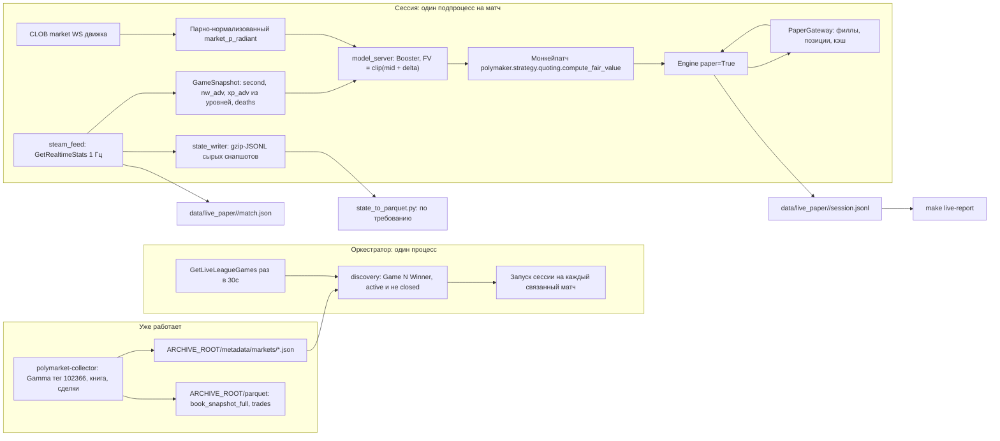

# Лайв на Dota 2: архив состояния игры плюс бумажная торговля

Термины: **филл** — исполнение нашего ордера. **Paper-режим** — котировки против живой книги без реальных денег. **Справедливая цена** (fair value, FV) — цена radiant по модели. **Окно модели** — секунды игры 0..600, где модель валидна. **Горн** — момент старта игры, от него идёт игровой отсчёт.

## Зачем

Два результата на одном процессе.

1. **Архив состояния игры.** Посекундная запись матча из Steam, с метадатой и ссылкой на рынок Polymarket. Он нужен, чтобы на новых матчах отказаться от STRATZ и OpenDota.
2. **Бумажная торговля.** Понять, сколько модель заработала бы на этом матче в лайве, и где именно она заходила и выходила.

Источник состояния игры — Steam Web API. `match.game_time` из `GetRealtimeStats` — уже часы от горна. Замер на лиге 19719: при t=2291 трансляция показывала 38:11. Якорь горна считать не надо.

## Решения

- **XP из уровней.** Steam отдаёт `level` игрока, но не XP. Считаем XP по фиксированной таблице порогов уровней. Тот же расчёт применяем в обучении, иначе фича в лайве и в обучении разные.
- **Лаг источника 2 секунды.** Steam отстаёт от игрового сервера на 1.4-2.3 секунды. GRID отставал на 8.
- **Опрос раз в секунду, всегда.** Steam пересобирает снапшот 1 Гц. Гейт «данные приходят раз в 10 секунд» из бэктеста снимаем. Частоту не снижаем ни при каком расходе запросов.
- **Несколько ключей Steam.** Список в `.env`, выбор ключа на каждый запрос случайный. Расход считаем и шлём в Telegram, работу не режем.
- **Движок — poly-maker, `paper=True`.** Проверяем ровно тот код, через который потом пойдут реальные деньги.
- **Пишем только матчи с рынком.** Матч без рынка не пишем.
- **Сырые снапшоты, без parquet в лайве.** Лайв пишет gzip-JSONL. Parquet собирает отдельный скрипт по требованию.
- **Один матч — один подпроцесс.** Оркестратор следит за подпроцессами.
- **На паузе котировки снимаем.** Цель модели — цена через 300 секунд реального времени. На паузе этот горизонт не соответствует ничему в обучении.
- **Метадата пишется дважды:** при старте и при завершении матча.
- **Связка рынка и матча:** имена команд плюс ручной `overrides.json`.
- **Запуск:** сначала локально под присмотром, потом на VPS.

## Что уже есть и не переписываем

- **`polymarket-collector`** — TypeScript-демон на VPS в Docker. Опрашивает Gamma по тегу `102366` раз в 60 секунд, отбирает `series_winner` и `map_winner`, стримит книгу и сделки в журнал, раз в день собирает Telonex-совместимый parquet. Пишет `metadata/markets/<condition_id>.json` со всем, что нужно нашему боту: `conditionId`, `marketSlug`, `marketKind`, `mapNumber`, `outcomes[].name` и `outcomes[].tokenId`, `tickSize`, `minOrderSize`, `negRisk`, `active`, `closed`, `acceptingOrders`, `startAt`, `gridSeriesId`. Корень задаёт `ARCHIVE_ROOT`. Контракт: `polymarket-collector/docs/polymarket_dota_archive_contracts.md`.
- **`scripts/watch_steam_live.py`** — рабочий клиент Steam. Умеет список живых лиговых игр, выбор матча, опрос `GetRealtimeStats` 1 Гц с вычетом времени запроса, счёт башен по выжившим, детект паузы и конца игры. Из него забираем логику, а сам скрипт оставляем как ручной инструмент.
- **`src/shared/types/steam.py`** — типы Steam-ответов. Дополняем полями, которые начнём читать.
- **poly-maker Engine** — `Engine(cfg, paper=True)` уже есть (`src/polymaker/engine.py:48`). `compute_fair_value` импортирован в `engine.py:40` и вызывается в `_recompute_locked`.

## Архитектура



## Часть A — модель под контракт Steam (гейт запуска)

Три изменения контракта. Все три ломают текущую модель, поэтому их делаем вместе и переобучаем один раз.

### A1. XP из уровней

Steam не отдаёт XP. `SteamRealtimePlayer` несёт `level`. Поэтому фичу `radiant_xp_adv` переопределяем: сумма порогов XP по уровням пяти героев radiant минус то же по dire.

Новый код:

- `src/shared/constants/dota.py`: `LEVEL_XP` — кумулятивный порог XP для уровней 1..30. Константа, 30 чисел.
- `src/shared/utils/dota_levels.py`: `experience_at_level(level)` и `radiant_xp_advantage(radiant_levels, dire_levels)`. Одна функция на лайв и на подготовку датасета.

Источник уровней в обучении — `player["stats"]["level"]` из кэша STRATZ. Это **не** уровень по минутам: это список секунд, когда игрок брал уровень. Длина списка равна финальному уровню игрока. Уровень на секунде `t` — количество элементов `<= t`. Первый элемент отрицательный (спавн до горна).

Замерено: все 1750 матчей `training_dataset.parquet` и все 328 матчей `validation_dataset.parquet` имеют профиль кэша `stratz_rich_v3`, то есть `stats` есть у каждого. Довыкачивать STRATZ не нужно. Для справки: во всём кэше v3 только 5074 из 18915 матчей, но в датасет попали именно они.

Правки:

- `src/prepare_dataset/prepare_dataset.py:340` — минутные строки обучения перестают брать `xp_leads[lead_index]` и считают XP из уровней.
- `src/prepare_dataset/prepare_dataset.py:423` и `src/shared/utils/stratz_seconds.py` — посекундные строки валидации тоже считают XP из уровней. Поле `radiant_nw_adv` не трогаем: оно остаётся из `playerUpdateGoldEvents`.

Проверки внутри шага:

1. Для каждого игрока `len(stats["level"]) == player["level"]`. Расхождение — ошибка, не предупреждение.
2. Уровень, выведенный из накопленного XP по `experienceEvents`, совпадает с уровнем из `stats["level"]` на границах минут в валидационных матчах. Это ловит смену таблицы XP между патчами.

### A2. Лаг источника: 8 -> 2

`SOURCE_LAG_SECONDS` в `src/shared/constants/dataset.py:13` ставим в `2`. Контракт обучения становится: состояние игры на секунде `T`, рынок на `T + 2`. Валидация и бэктест: рынок на `T`, состояние на `T - 2`.

### A3. Частота сигнала: 10 -> 1

`POLL_INTERVAL_SECONDS` в `src/shared/constants/dataset.py` ставим в `1`. `MAX_SIGNAL_AGE_SECONDS` в `src/backtest/signals.py:28` считается от него и станет `1` без правки. Валидационные строки уже 1 Гц, пересобирать их ради этого не нужно.

Цена решения: бэктест выдаёт в десять раз больше тиков модели и котировок. Прогон становится дольше. Это осознанный обмен: контракт совпадает с лайвом.

### A4. Пересборка и переобучение

1. Пересобрать `training_dataset.parquet` и `validation_dataset.parquet`.
2. Переобучить, сохранить в новый каталог модели, старую `data/new_model/model.txt` не затирать.
3. Сравнить метрики старой и новой модели на одном сплите. Записать числа в learnings.
4. Прогнать бэктест на новой модели с `POLL_INTERVAL_SECONDS = 1` и сравнить PnL со старым прогоном.

Гейт: если новая модель заметно хуже старой, в лайв не идём. Сначала разбираемся, что именно просело — квантование XP, лаг или частота. Каждое изменение можно включить по отдельности.

## Часть B — архив состояния игры

### B1. `src/live_paper/steam_feed.py`

Следит за одним матчем. Опрашивает `GetRealtimeStats` по `server_steam_id` раз в секунду, вычитая время запроса из сна. Отдаёт два потока: сырой payload для записи и `GameSnapshot` для модели.

```python
@dataclass(frozen=True)
class GameSnapshot:
    second: int              # match.game_time, часы от горна
    server_timestamp: int    # match.timestamp, тикает всегда
    game_state: int
    radiant_nw_adv: int
    radiant_xp_adv: int      # из уровней, LEVEL_XP
    deaths_radiant: int
    deaths_dire: int
    paused: bool
    finished: bool
```

- `radiant_nw_adv` — `net_worth` команды 2 минус `net_worth` соперника.
- `radiant_xp_adv` — через `radiant_xp_advantage` из части A1. Та же функция, что в подготовке датасета.
- Смерти — сумма `death_count` игроков стороны. Сверяем с `score` соперника; расхождение логируем и продолжаем.
- Пауза — рост `timestamp - game_time` между снапшотами. `game_time` на паузе замирает.
- Конец — `game_state >= 6`.
- `server_steam_id` берём из `GetTopLiveGame`, при промахе — из OpenDota `/live`. `GetLiveLeagueGames` его не несёт.

### B2. `src/live_paper/state_writer.py`

Пишет сырой payload как есть, по строке на снапшот, в `data/live_paper/<match_id>/state.jsonl.gz`. Каждая строка — объект с локальным временем приёма, временем запроса и телом ответа. Никакого разбора: разбор — задача конвертера.

Размер: снапшот 16.6 КБ, в gzip 3.6 КБ. Матч на 40 минут — около 9 МБ.

Дозапись после падения: оркестратор перезапускает сессию, та открывает файл на добавление. Разрыв виден по прыжку `game_time` и попадает в метадату как `gaps`.

### B3. `src/live_paper/match_meta.py`

`data/live_paper/<match_id>/match.json`, две записи.

При старте: `match_id`, `server_steam_id`, `league_id`, имена команд и какая сторона какая, номер карты, `joined_at_second` (с какой секунды подключились), локальное UTC подключения, оценка UTC горна (`timestamp - game_time`), и блок рынка: `condition_id`, `market_slug`, `event_slug`, оба `token_id`, `yes_is_radiant`, `tick_size`, `min_order_size`, `neg_risk`, `grid_series_id`.

При завершении дописываем: длительность, победитель, суммарная пауза, число пропущенных секунд, число снапшотов, PnL сессии.

Победитель: у Steam нет истории, а `GetMatchDetails` мёртв (500 на свежих id, пустой `{}` на старых). Берём его из последнего снапшота по зданиям.

В `buildings` три типа: `0` — башня, `1` — барак, `2` — ancient. Фонтана в списке нет. Разрушенное здание теряет `team` и `type` и становится обезличенным `team=0 type=0 destroyed=true`. Поэтому снесённый ancient от снесённой башни не отличить. Считаем по выжившим: проиграла сторона, у которой ноль зданий с `type == 2`. Проверено на живом матче: 9 стоящих башен Radiant, 6 у Dire, 7 обезличенных обломков, всего 22 = 11 башен на сторону.

Риск: последний снапшот может не дойти. Сервер снимает матч сразу после конца, и `buildings` в поздних ответах бывает пустым. Тогда пишем `null` и добираем результат из OpenDota отдельным шагом.

### B4. `src/live_paper/state_to_parquet.py`

Отдельный скрипт, в лайве не запускается. Читает `state.jsonl.gz` одного матча или всех, раскладывает в колонки и пишет parquet рядом. Колонки: секунда, состояние игры, netWorth и уровни по игрокам, счёт, смерти, живые здания, флаг паузы. Схема живёт в `src/shared/types/steam.py`.

### B5. Ключи Steam и бюджет запросов

Лимит — 100000 запросов в сутки **на ключ**.

- Один матч 1 Гц, 40 минут: 2400 запросов.
- Поиск матчей: `GetLiveLeagueGames` раз в 30 секунд — 2880 в сутки.
- Четыре матча одновременно по 10 часов: 144000. Одного ключа не хватает.

Решение — несколько ключей. `STEAM_KEYS` в `.env`: ключи через запятую. Перед каждым запросом берём `random.choice(keys)`. Старый `STEAM_KEY` остаётся рабочим как список из одного элемента.

Частоту опроса **не снижаем никогда**. Матч пишется 1 Гц от подключения до конца, независимо от расхода.

Расход считаем и показываем. Счётчик за сутки на процесс. При переходе через 80% от `100000 * число_ключей` уходит уведомление в Telegram. Дальше — по одному уведомлению на каждые следующие 10%. Работу это не меняет.

```python
# ponytail: случайный выбор ключа без учёта расхода по каждому. На тысячах
# запросов разброс мал. Если один ключ начнёт упираться в лимит — перейти
# на выбор наименее нагруженного.
# ponytail: суточный счётчик в памяти процесса; после рестарта считает с нуля.
```

### B6. `src/live_paper/notify.py`

Одна функция: отправка текста в Telegram через Bot API. Токен и чат берём из `TG_BOT_API_TOKEN` и `TG_CHAT_ID` — те же имена, что у `polymarket-collector`. Переменных нет — молча ничего не шлём.

Три точки вызова:

1. Расход ключей перешёл очередной порог (B5).
2. Матч найден, но связать рынок и матч Steam не вышло. Это тихая потеря матча, о ней надо знать сразу.
3. Сессия упала и не поднялась после повторов.

## Часть C — бумажная торговля

### C1. `src/live_paper/discovery.py`

Читает каталог `ARCHIVE_ROOT/metadata/markets/*.json` коллектора. Свою дискавери Gamma не пишем: коллектор уже опрашивает тег, фильтрует рынки и держит сайдкары актуальными.

Отбор: `marketKind == "map_winner"`, `active`, не `closed`, `acceptingOrders`, `enableOrderBook`. Из сайдкара берём `conditionId`, `marketSlug`, `outcomes[].name` и `outcomes[].tokenId`, `tickSize`, `minOrderSize`, `negRisk`.

Связка со Steam: имена из `outcomes[].name` сопоставляем с `radiant_team.team_name` и `dire_team.team_name` из `GetLiveLeagueGames`. Используем `score_team_name` и `TEAM_ALIASES` из `src/collect/02_link_opendota.py`, порог 60. Отсюда же берём `yes_is_radiant`. Промах — пропуск и громкая строка в логе.

Ручной перебив: `data/live_paper/overrides.json`, отображение `condition_id -> match_id`. Читается на каждом цикле дискавери, перезапуск не нужен.

Номер карты: `mapNumber` из сайдкара против `radiant_series_wins + dire_series_wins + 1` из `GetLiveLeagueGames`. Расхождение — не торгуем, пишем в лог. Поля серии добавляем в `SteamLeagueGame`.

Локальный запуск требует доступа к `ARCHIVE_ROOT`. Варианта два: поднять коллектор локально через его `compose.yaml`, либо примонтировать каталог с VPS. Путь задаём переменной окружения.

### C2. `src/live_paper/model_server.py`

Грузит модель через `lgb.Booster`. Собирает вектор `FEATURE_COLUMNS` из `src/train_model/train_model.py`. `predict_fair(snapshot, market_p_radiant) -> clip(market_p_radiant + delta, 0, 1)`.

Кормим модель свежим снапшотом Steam без дополнительной задержки. После части A2 контракт обучения совпадает с тем, что видит бот.

### C3. `src/live_paper/paper_gateway.py`

`PaperGateway(ExecutionGateway)`. Хранит наши ордера. Правило филла: стоящий BUY по цене `p` исполняется, только когда лучший аск **ниже** `p` или последняя сделка ниже `p`. Для SELL зеркально. Касание цены филлом не считается: ордер ещё стоит в очереди.

В paper-режиме движка `get_positions` вернул бы пусто, и движок покупал бы бесконечно. Гейтвей переопределяет `get_positions` и `get_open_orders` и отдаёт симулированное состояние. Тогда скью `gamma` и лимиты `q_max_usdc` и `q_soft_frac` работают как в лайве.

```python
# ponytail: филл на полный размер, без позиции в очереди. Потолок — оптимизм
# на размере свипа. Если он будет мешать сравнению с бэктестом, брать позицию
# в очереди из архива книги коллектора.
```

### C4. `src/live_paper/session.py`

Один матч. Порядок:

1. Собирает временный config-dir: `config.toml`, `strategy.toml` с профилем `dota-map`, `markets.toml`.
2. Пишет рынок в `CatalogStore` (state.db) прямо из сайдкара коллектора и указывает на него в `markets.toml`. `scanner.py` в форке не трогаем.
3. Патчит `compute_fair_value` до `Engine.run_forever()`.
4. Запускает `Engine(cfg, paper=True)` с `PaperGateway`.
5. Держит гейт окна: котировки только при `0 <= second <= 600`.

Когда свежего сигнала нет, патч возвращает обычный микропрайс **и** сессия снимает наши ордера штатной отменой движка. Котируем только с преимуществом модели. Сигнала нет в четырёх случаях: до горна, секунда больше 600, фид протух, идёт пауза.

После окна новых BUY нет. Движок продолжает maker-SELL, пока позиция не закроется или рынок не завершится.

Журнал сессии `session.jsonl`: `signal` (секунда, фичи, дельта, FV, мид), `quote` (FV, режим, поставлено или отменено), `fill` (сторона, цена, размер, инвентарь, кэш), `session_end` (инвентарь, отметка по резолюции или миду, реализованный и нереализованный PnL). Полную книгу в журнал не пишем: она есть в архиве коллектора по `asset_id` и дню. Пишем только входы решения: лучший бид, лучший аск, мид.

### C5. `src/live_paper/orchestrator.py`

Главный цикл: дискавери, запуск и остановка подпроцессов, переход между картами серии, перезапуск упавших с backoff, бюджет запросов Steam из B5, раскладка `data/live_paper/`. Цель `make live-paper`.

## Часть D — отчёт

`src/live_paper/report.py` и `make live-report`. Таблица по матчам и итог: филлы, реализованный PnL, нереализованный PnL, аптайм фида, покрытие сигналом, число пропущенных секунд.

Маркет-мейкерский ребейт считаем только в постобработке: `0.15 * 0.05 * qty * p * (1 - p)`. Комиссию тейкера ставим в ноль.

## Профиль стратегии для доты

Стартовый профиль `dota-map` в `strategy.toml` сессии. Настроен под рынки около 40 минут вместо политических дефолтов:

`micro_levels=3`, `flow_ewma_halflife_s=30` (было 120), `vol_long_halflife_s=300` (было 900), `delta_min_ticks=2`, `c_vol=1.2`, `c_tox=2.0`, `base_size_usdc=50`, `q_max_usdc=200`, `layers=2`, `layer_step_ticks=2`, `reprice_ticks=2`, `min_edge_ticks=1`, `event_cooloff_s=20`, `event_jump_ticks=8`, `reduce_only_hours=0`, `halt_before_hours=0`.

Гейт по игровым секундам заменяет halt по датам. Размеры виртуальные. `base_size_usdc` выравниваем с бэктестным `TRADE_SIZE` ради сравнимости. Тюним по логам `requote` после первых матчей. Автооптимизатор не делаем.

## Проверка

- Юнит-тесты: уровень в XP, уровень из `stats.level` на границе секунды, правило филла (касание против прохода), разворот ориентации, гейт окна, детект паузы, клип в `predict_fair`.
- Проверки датасета из A1 идут в самом шаге подготовки и падают на расхождении.
- Чистый `make lint-all`. Строгий basedpyright на `src/live_paper/`.
- Сухой прогон: сессия на любом открытом рынке доты с выключенной моделью. Доказывает цепочку сайдкар -> движок -> paper-котировки -> JSONL без ключей.
- Первый живой матч под присмотром локально. Смотрим три вещи: секунды не пропадают, ориентация верная, котировки снимаются на паузе.
- После матча: сверить наш `session.jsonl` с архивом книги коллектора за тот же день. Проверить, что филлы стоят на реальных проходах цены.
- Только потом — VPS без присмотра.

## Вне скоупа

- Реальные деньги.
- Правки `polymarket-collector` и `poly-maker`.
- Реплей журналов в Nautilus как отдельный продукт (сверка после матча — часть проверки, не отдельная система).
- Правки `src/live_dashboard/`.
- Автотюнинг параметров мейкера.
- Матчи без рынка на Polymarket.
- Сбор XP через `xp_per_min` из `GetLiveLeagueGames`.
