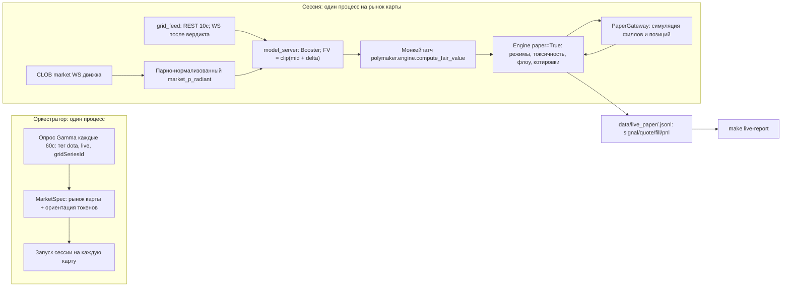

# Бумажная торговля в лайве на Dota 2 через poly-maker

Термины: **филл** — исполнение нашего ордера. **Paper-режим** — котировки против живой книги без реальных денег. **Справедливая цена** (fair value, FV) — цена radiant по модели. **Окно модели** — секунды игры 0..600, где модель валидна.

## Решения (по ответам в интервью)

- Филлы считает лёгкий симулятор в нашей обёртке. Филл — только когда книга проходит **сквозь** нашу цену. Реплей в Nautilus не делаем.
- Код живёт в новом пакете `src/live_paper/` в [dota_2_model](dota_2_model/). poly-maker подключаем как editable path-зависимость. Форк не меняем. Обновления апстрима подтягиваются без конфликтов.
- Торгуем только рынки победителя карты (`Game N Winner`). Для BO1 рынок серии — это и есть рынок карты.
- После окна модели новых BUY нет. Движок продолжает maker-SELL до закрытия позиции или конца рынка.
- Фид решает проверка WS. Фаза 0 записывает бесплатный сокет GRID на живом матче. Бот выходит в лайв только после вердикта. REST-опрос (10 с) — гарантированный запасной вариант. Он совпадает с контрактом бэктеста.

## Архитектура

Ключевая механика:

- **Одна сессия = один подпроцесс = один рынок карты.** У движка нет плагинного API. `compute_fair_value` не принимает id рынка. Один рынок на процесс делает монкейпатч тривиальным и изолирует падения. Оркестратор следит за N сессиями: параллельные серии и переходы между картами BO2/BO3.
- **Подача FV без форка.** Сессия патчит `polymaker.engine.compute_fair_value` до запуска `Engine.run_forever()`. Это имя импортировано в [engine.py](poly-maker/src/polymaker/engine.py) и вызывается в `_recompute_locked`. Когда свежего сигнала нет (до горна, секунда > 600, фид протух): патч возвращает обычный микропрайс **и** сессия снимает наши ордера штатной отменой движка. Котируем только с модельным преимуществом.
- **Резолюция рынка без politics-сканера.** Сессия сама забирает рынок из Gamma по slug и пишет его в `CatalogStore` (state.db). Потом указывает на него в `markets.toml`. [scanner.py](poly-maker/src/polymaker/catalog/scanner.py) не меняем.
- **Симулированный инвентарь возвращается в движок.** В paper-режиме `get_positions` возвращает `{}`. Движок всегда считал бы позицию нулевой и продолжал бы покупать. Наш `PaperGateway(ExecutionGateway)` переопределяет positions и open-orders и отдаёт симулированное состояние. Поэтому скью `gamma` и лимиты `q_max_usdc`/`q_soft_frac` работают как в лайве.

## Фаза 0 — проверка GRID WS (гейт)

История: дамп от 25.07 ([data/live_grid_polymarket/](dota_2_model/data/live_grid_polymarket/)) показал: бесплатный сокет `wss://api.grid.gg/widgets-v2/live/{seriesId}` шлёт `live_log` по событиям (киллы, уровни, башни). Каналы `team_stats`/`game` несут только K/D/A и уровни. **Нетварса и XP там нет**, а модели нужны `radiant_nw_adv` и `radiant_xp_adv`. Проверка должна подтвердить это на текущем матче и перебрать каналы:

- `src/live_paper/grid_ws_probe.py`: берёт живую серию (автопоиск по `gridSeriesId` из Gamma или флаг `--series-id`). Открывает сокеты по вариантам каналов (`events=live_log`, `stats`, `game`, `compare`, `team_stats`, все вместе, без параметра) с Origin `https://polymarket.com`. Пишет сырые фреймы с таймстемпами в `data/live_ws_probe/`.
- `src/live_paper/grid_ws_report.py`: по каждому каналу — частота сообщений, схема, поиск полей netWorth/XP/часов. Несколько снапшотов сверяем с REST-опросом `seriesState` на корректность.
- Вердикт: если бесплатный канал даёт NW+XP+часы с частотой не хуже REST — добавляем WS-реализацию интерфейса фида. Иначе выкатываем только REST и оставляем probe на потом.

## Компоненты (все новые, в dota_2_model)

Правила репо: frozen dataclasses, без `dict[str, Any]` для своих данных, строгий basedpyright, докстринги, глаголы в именах, импорты наверху. После правок — `make lint-all`.

1. **Зависимости** — [pyproject.toml](dota_2_model/pyproject.toml): `polymaker` через `[tool.uv.sources] polymaker = { path = "../poly-maker", editable = true }`. Плюс `websockets` для probe и фида. Python 3.13 совместим с poly-maker 3.12+.
2. **`src/live_paper/grid_feed.py`** — `GameSnapshot(second, radiant_nw_adv, radiant_xp_adv, deaths_radiant, deaths_dire, game_no, finished)` и `RestGridFeed` (опрос `seriesState` каждые 10с, заголовок `x-api-key`, эндпоинты из [api.py](dota_2_model/src/shared/constants/api.py)). Смерти берём из поля `deaths` команды и сверяем с `kills` соперника. Интерфейс фида позволяет потом подставить `WsGridFeed` без изменений остального кода.
3. **`src/live_paper/model_server.py`** — грузит `NEW_MODEL_PATH` через `lgb.Booster`. Фичи — `FEATURE_COLUMNS` из [train_model.py](dota_2_model/src/train_model/train_model.py). `predict_fair(snapshot, market_p_radiant) -> clip(mid + delta, 0, 1)`. Лайв следует контракту лагged-плана: GRID-пayload как есть (он уже запаздывает ~8с) + текущий мид CLOB. Дополнительный лаг не добавляем.
4. **`src/live_paper/discovery.py`** — каждые 60с опрашивает события Gamma по тегу доты (tag_id 102366, как в [01_build_universe.py](dota_2_model/src/collect/01_build_universe.py)). Оставляет живые события с `eventMetadata.gridSeriesId`. По состоянию GRID выбирает активную карту серии. Выбирает рынок карты (`sportsMarketType` child moneyline `Game N Winner`; для BO1 — манилайн серии). Определяет `yes_is_radiant` матчем имён команд (порог 60, с учётом `TEAM_ALIASES`). Выдаёт `MarketSpec(slug, condition_id, yes_token, no_token, tick_size, grid_series_id, game_no, yes_is_radiant)`. При неоднозначности — пропуск и лог.
5. **`src/live_paper/paper_gateway.py`** — `PaperGateway(ExecutionGateway)`: хранит resting paper-ордера. На каждом `place_quotes` и тике книги: resting BUY по цене `p` филлится, только когда лучший аск `< p` или последняя сделка `< p`. Для SELL симметрично. Касание цены — ордер ещё в очереди. Филл на полный размер, с `ponytail:`-комментарием (без позиции в очереди; потолок — оптимизм на размере свипа). Считает кэш и позиции. Переопределяет paper `get_positions`/`get_open_orders`, отдаёт симулированное состояние.
6. **`src/live_paper/session.py`** — одна карта: собирает временный config-dir (`config.toml`, `strategy.toml` с профилем `dota-map`, `markets.toml`), пишет рынок в каталог, ставит патч FV и отмену ордеров при потере сигнала, запускает `Engine(cfg, paper=True)` с `PaperGateway`. Держит окно: котировки только при `0 <= секунда <= 600`. Дальше — только выходы, пока позиция не закроется или рынок не завершится. Завершается по концу карты или серии.
7. **`src/live_paper/orchestrator.py`** — главный цикл: дискавери -> запуск и остановка сессий-подпроцессов, переход между картами (карта N кончилась -> ищем рынок карты N+1), рестарт упавших сессий с backoff, раскладка `data/live_paper/`. Цель `make live-paper`. Запуск на VPS — однострочник для `tmux`/`systemd` в README.
8. **Логи и обзор** — JSONL сессии: `signal` (секунда, фичи, дельта, FV, мид), `quote` (FV, режим, поставлено/отменено), `fill` (сторона, цена, размер, инвентарь, кэш), `session_end` (инвентарь, отметка по резолюции или миду, реализованный + нереализованный PnL). Собственные `logs/paper.jsonl` и `journal/paper.jsonl` движка лежат в config-dir сессии. `src/live_paper/report.py` и `make live-report`: таблица по матчам и итог (филлы, PnL, аптайм, покрытие сигналом).

## Профиль стратегии для доты (стартовый, `dota-map` в strategy.toml сессии)

Настроен под рынки ~40 минут вместо политических дефолтов: `micro_levels=3`, `flow_ewma_halflife_s=30` (было 120), `vol_long_halflife_s=300` (было 900), `delta_min_ticks=2`, `c_vol=1.2`, `c_tox=2.0`, `base_size_usdc=50`, `q_max_usdc=200`, `layers=2`, `layer_step_ticks=2`, `reprice_ticks=2`, `min_edge_ticks=1`, `event_cooloff_s=20`, `event_jump_ticks=8`, `reduce_only_hours=0`, `halt_before_hours=0` (гейт по игровым часам заменяет halt по датам). Размеры виртуальные. `base_size_usdc` выравниваем с бэктестным `TRADE_SIZE` для сравнимости. Тюнинг — по логам `requote` после первых матчей. Автооптимизатор не делаем (YAGNI).

## Проверка

- Юнит-тесты: правило филла (касание против прохода), разворот ориентации, сборка фичей из записанного GRID-payload (фикстуры из [data/live_grid_polymarket/](dota_2_model/data/live_grid_polymarket/)), гейт окна, клип в `predict_fair`.
- Чистый `make lint-all`. Строгий pyright на `src/live_paper/`.
- Сухой прогон: сессия на любом открытом рынке доты с выключенной моделью. Доказывает цепочку дискавери -> движок -> paper-котировки -> JSONL без ключей.
- Первый живой матч: сначала probe, потом одна контролируемая paper-сессия end-to-end, потом запуск на VPS без присмотра.

## Вне скоупа

- Реальные деньги, реплей журналов в Nautilus, правки `src/live_dashboard/`, висящий план lagged-бэктеста, автотюнинг параметров мейкера, изменения форка poly-maker.
