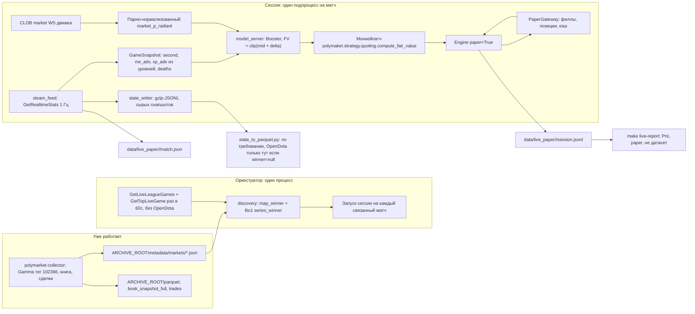

# Лайв на Dota 2: архив состояния игры плюс бумажная торговля

Термины: **филл** — исполнение нашего ордера. **Paper-режим** — котировки против живой книги без реальных денег. **Справедливая цена** (fair value, FV) — цена radiant по модели. **Окно модели** — секунды игры 0..600, где модель валидна. **Горн** — момент старта игры, от него идёт игровой отсчёт.

## Зачем

Два результата на одном процессе.

1. **Архив состояния игры.** Посекундная запись матча из Steam, с метадатой и ссылкой на рынок Polymarket. Он нужен, чтобы на новых матчах отказаться от STRATZ и OpenDota.
2. **Бумажная торговля.** Понять, сколько модель заработала бы на этом матче в лайве, и где именно она заходила и выходила.

Источник состояния игры — Steam Web API. `match.game_time` из `GetRealtimeStats` — уже часы от горна. Замер на лиге 19719: при t=2291 трансляция показывала 38:11. Якорь горна считать не надо.

## Решения

- **XP из уровней.** Steam отдаёт `level` игрока, но не XP. Считаем XP по фиксированной таблице порогов уровней. Тот же расчёт применяем в обучении, иначе фича в лайве и в обучении разные.
- **Лаг источника 2 секунды.** Steam отстаёт от игрового сервера на 1.4-2.3 секунды. GRID отставал на 8.
- **Опрос раз в секунду, всегда.** Steam пересобирает снапшот 1 Гц. Гейт «данные приходят раз в 10 секунд» из бэктеста снимаем. Частоту не снижаем ни при каком расходе запросов.
- **Два ключа Steam по очереди.** Все запросы ключом 1. Первый 429 — ключ 2 и Telegram. Счётчика расхода нет.
- **Движок — poly-maker, `paper=True`.** Проверяем ровно тот код, через который потом пойдут реальные деньги.
- **Пишем только матчи с рынком.** Матч без рынка не пишем.
- **Сырые снапшоты, без parquet в лайве.** Лайв пишет gzip-JSONL. Parquet собирает отдельный скрипт по требованию.
- **Один матч — один подпроцесс.** Оркестратор следит за подпроцессами.
- **На паузе котировки снимаем.** Цель модели — цена через 300 секунд реального времени. На паузе этот горизонт не соответствует ничему в обучении.
- **Метадата пишется дважды:** при старте и при завершении матча.
- **Связка рынка и матча:** тот же матчер, что в `02_link_opendota.py` (`score_team_name` + `TEAM_ALIASES`). Ручной `overrides.json` не нужен: алиасы уже есть, а лиги без имён на Steam на Polymarket не торгуются. Новый алиас — строка в `TEAM_ALIASES`, не отдельный файл.
- **Лайв-демон OpenDota не вызывает.** `server_steam_id` только из `GetTopLiveGame`. Победителя, которого не дали здания Steam, добираем из OpenDota позже, когда разбираем JSON (конвертер / отчёт).
- **Запуск сразу на VPS.** Сайдкаров коллектора на ноутбуке нет, второй коллектор локально не поднимаем. Код и тесты — локально, живой демон — Docker Compose на VPS рядом с коллектором, `restart: unless-stopped`, тот же `ARCHIVE_ROOT`. Первый матч смотрим по логам и Telegram, не с локальной машины.

## Что уже есть и не переписываем

- **`polymarket-collector`** — TypeScript-демон на VPS в Docker. Опрашивает Gamma по тегу `102366` раз в 60 секунд, отбирает `series_winner` и `map_winner`, стримит книгу и сделки в журнал, раз в день собирает Telonex-совместимый parquet. Пишет `metadata/markets/<condition_id>.json` со всем, что нужно нашему боту: `conditionId`, `marketSlug`, `marketKind`, `mapNumber`, `outcomes[].name` и `outcomes[].tokenId`, `tickSize`, `minOrderSize`, `negRisk`, `active`, `closed`, `acceptingOrders`, `startAt`, `gridSeriesId`. Корень задаёт `ARCHIVE_ROOT`. Контракт: `polymarket-collector/docs/polymarket_dota_archive_contracts.md`.
- **`scripts/watch_steam_live.py`** — рабочий клиент Steam. Умеет список живых лиговых игр, выбор матча, опрос `GetRealtimeStats` 1 Гц с вычетом времени запроса, счёт башен по выжившим, детект паузы и конца игры. Логику забираем в `steam_feed.py`, скрипт оставляем как ручной инструмент. Вызов OpenDota `/live` из вотчера в демон **не** переносим.
- **`src/shared/`** — сюда выносим то, что нужно и лайву, и пайплайну: `LEVEL_XP`, `score_team_name`, `TEAM_ALIASES`, `normalize_team_name`. Сейчас матчер живёт в `src/collect/02_link_opendota.py`; из `collect` не импортируем (это старый код). После выноса `02_link_opendota.py` читает shared, как и discovery.
- **`src/shared/types/steam.py`** — типы Steam-ответов. Дополняем полями, которые начнём читать.
- **poly-maker Engine** — `Engine(cfg, paper=True)` уже есть (`src/polymaker/engine.py:48`). `compute_fair_value` импортирован в `engine.py:40` и вызывается в `_recompute_locked`. Форк не меняем, только path-зависимость и монкейпатч.
- **Коллектор на TypeScript — не проблема и не дубль.** Он уже пишет сайдкары и книгу. Бот читает файлы с диска. Gamma и книгу заново не собираем. Язык другой — это нормально: два процесса, один контракт на `ARCHIVE_ROOT`.

## Архитектура



## Часть A — модель под контракт Steam (гейт запуска)

Три изменения контракта. Все три ломают текущую модель, поэтому их делаем вместе и переобучаем один раз.

### A1. XP из уровней

Steam не отдаёт XP. `SteamRealtimePlayer` несёт `level`. Поэтому фичу `radiant_xp_adv` переопределяем: сумма порогов XP по уровням пяти героев radiant минус то же по dire.

Новый код:

- `src/shared/constants/dota.py`: `LEVEL_XP` — кумулятивный порог XP для уровней 1..30. Константа, 30 чисел.
- `src/shared/utils/dota_levels.py`: `experience_at_level(level)` и `radiant_xp_advantage(radiant_levels, dire_levels)`. Одна функция на лайв и на подготовку датасета.

Источник уровней в обучении — `player["stats"]["level"]` из кэша STRATZ. Это **не** уровень по минутам: это список секунд, когда игрок брал уровень. Длина списка равна финальному уровню игрока. Уровень на секунде `t` — количество элементов `<= t`. Первый элемент отрицательный (спавн до горна).

Замерено: все 1750 матчей `training_dataset.parquet` и все 328 матчей `validation_dataset.parquet` имеют профиль кэша `stratz_rich_v3`, то есть `stats` есть у каждого. Довыкачивать STRATZ не нужно. Для справки: во всём кэше v3 только 5074 из 18915 матчей, но в датасет попали именно они.

Правки:

- `src/prepare_dataset/prepare_dataset.py:340` — минутные строки обучения перестают брать `xp_leads[lead_index]` и считают XP из уровней.
- `src/prepare_dataset/prepare_dataset.py:423` и `src/shared/utils/stratz_seconds.py` — посекундные строки валидации тоже считают XP из уровней. Поле `radiant_nw_adv` не трогаем: оно остаётся из `playerUpdateGoldEvents`.

Проверки внутри шага:

1. Для каждого игрока `len(stats["level"]) == player["level"]`. Расхождение — ошибка, не предупреждение.
2. Уровень, выведенный из накопленного XP по `experienceEvents`, совпадает с уровнем из `stats["level"]` на границах минут в валидационных матчах. Это ловит смену таблицы XP между патчами.

### A2. Лаг источника: 8 -> 2

`SOURCE_LAG_SECONDS` в `src/shared/constants/dataset.py:13` ставим в `2`. Контракт обучения становится: состояние игры на секунде `T`, рынок на `T + 2`. Валидация и бэктест: рынок на `T`, состояние на `T - 2`.

### A3. Частота сигнала: 10 -> 1

`POLL_INTERVAL_SECONDS` в `src/shared/constants/dataset.py` ставим в `1`. `MAX_SIGNAL_AGE_SECONDS` в `src/backtest/signals.py:28` считается от него и станет `1` без правки. Валидационные строки уже 1 Гц, пересобирать их ради этого не нужно.

Цена решения: бэктест выдаёт в десять раз больше тиков модели и котировок. Прогон становится дольше. Это осознанный обмен: контракт совпадает с лайвом.

### A4. Пересборка и переобучение

1. Пересобрать `training_dataset.parquet` и `validation_dataset.parquet`.
2. Переобучить, сохранить в новый каталог модели, старую `data/new_model/model.txt` не затирать.
3. Сравнить метрики старой и новой модели на одном сплите. Записать числа в learnings.
4. Прогнать validation-бэктест на новой модели с `POLL_INTERVAL_SECONDS = 1`. Старый прогон не трогаем: новое имя папки через `--name`. Четыре шарда, потом merge.

```bash
# четыре воркера, одна новая папка рядом со старым прогоном
make backtest ARGS="--validation --shard 0/4 --name steam-xp-lag2-1hz"
make backtest ARGS="--validation --shard 1/4 --name steam-xp-lag2-1hz"
make backtest ARGS="--validation --shard 2/4 --name steam-xp-lag2-1hz"
make backtest ARGS="--validation --shard 3/4 --name steam-xp-lag2-1hz"
make backtest ARGS="--validation --merge-shards 4 --name steam-xp-lag2-1hz"
```

Папка будет `data/backtests/dota_maker/validation_<profiles>_..._steam-xp-lag2-1hz/`. Старый каталог без суффикса остаётся для сравнения PnL.

Гейт: если новая модель заметно хуже старой, в лайв не идём. Сначала разбираемся, что именно просело — квантование XP, лаг или частота. Каждое изменение можно включить по отдельности.

## Часть B — архив состояния игры

### B1. `src/live_paper/steam_feed.py`

Следит за одним матчем. Опрашивает `GetRealtimeStats` по `server_steam_id` раз в секунду, вычитая время запроса из сна. Отдаёт два потока: сырой payload для записи и `GameSnapshot` для модели.

```python
@dataclass(frozen=True)
class GameSnapshot:
    second: int              # match.game_time, часы от горна
    server_timestamp: int    # match.timestamp, тикает всегда
    game_state: int
    radiant_nw_adv: int
    radiant_xp_adv: int      # из уровней, LEVEL_XP
    deaths_radiant: int
    deaths_dire: int
    paused: bool
    finished: bool
```

- `radiant_nw_adv` — `net_worth` команды 2 минус `net_worth` соперника.
- `radiant_xp_adv` — через `radiant_xp_advantage` из части A1. Та же функция, что в подготовке датасета.
- Смерти — сумма `death_count` игроков стороны. Сверяем с `score` соперника; расхождение логируем и продолжаем.
- Пауза — рост `timestamp - game_time` между снапшотами. `game_time` на паузе замирает.
- Конец — `game_state >= 6`.
- `server_steam_id` берём только из `GetTopLiveGame`. `GetLiveLeagueGames` его не несёт. OpenDota `/live` в демоне не вызываем.

**Слабое звено: `server_steam_id`.** Без него `GetRealtimeStats` не вызвать, а матч не записать. Замеры 2026-08-14:

- `GetLiveLeagueGames` не отдаёт `server_steam_id` ни в общем списке, ни с фильтрами `league_id` и `match_id`. В объекте есть `lobby_id`, и он не подходит.
- `GetRealtimeStats` не принимает `match_id`. Подстановка `match_id` или `lobby_id` в `server_steam_id` даёт HTTP 400.
- `GetTopLiveGame` даёт 10 записей на слот `partner`. Когда живых тир-1 игр нет, все 40 записей при `partner` 0..3 — пабы с `league_id = 0`.
- OpenDota `/live` в лайв-процесс не входит. Цена: если `GetTopLiveGame` матч не отдал, `GetRealtimeStats` не вызвать. Тогда сессия ретраит поиск и шлёт Telegram, без второго источника.

**Замер на живом матче TI, 2026-08-14** (`league 19719`, Aurora Gaming против Team Yandex, `match_id 8944931337`, карта 2 серии Bo3):

- `GetLiveLeagueGames` матч отдаёт, с обоими именами команд, `series_type = 1` (Bo3) и `radiant_series_wins = 0`, `dire_series_wins = 1`. Номер карты сходится: `0 + 1 + 1 = 2`, и рынок называется `Game 2 Winner`. `stream_delay_s = 10`.
- `GetTopLiveGame` матч отдаёт вместе с `server_steam_id`. Из 19 уникальных игр по слотам `partner` 0..3 это была единственная лиговая. Значит цепочка `GetLiveLeagueGames` -> `GetTopLiveGame` на тир-1 работает.
- Замерять на мажоре с несколькими одновременными играми всё равно надо: слотов десять.

**Живость сервера проверяем по `game_state`, не по `matchid`.** В драфте `GetRealtimeStats` отвечает `matchid = null`, но при этом `league_id = 19719`, `game_state = 2`, имена команд заполнены. Мёртвый сервер отвечает `matchid = null`, `league_id = 0`, `game_state = 7`, имена пустые. Живым считаем ответ с `game_state != 7`.

Поведение при промахе: сессия не падает, а повторяет поиск `server_steam_id` каждый цикл до конца матча, и шлёт уведомление в Telegram после первой минуты без находки.

### B2. `src/live_paper/state_writer.py`

Пишет сырой payload как есть, по строке на снапшот, в `data/live_paper/<match_id>/state.jsonl.gz`. Каждая строка — объект с локальным временем приёма, временем запроса и телом ответа. Никакого разбора: разбор — задача конвертера.

Размер: снапшот 16.6 КБ, в gzip 3.6 КБ. Матч на 40 минут — около 9 МБ.

Дозапись после падения: оркестратор перезапускает сессию, та открывает файл на добавление. Разрыв виден по прыжку `game_time` и попадает в метадату как `gaps`.

### B3. `src/live_paper/match_meta.py`

`data/live_paper/<match_id>/match.json`, две записи.

При старте: `match_id`, `server_steam_id`, `league_id`, имена команд и какая сторона какая, номер карты, `joined_at_second` (с какой секунды подключились), локальное UTC подключения, оценка UTC горна (`timestamp - game_time`), и блок рынка: `condition_id`, `market_slug`, `event_slug`, оба `token_id`, `yes_is_radiant`, `tick_size`, `min_order_size`, `neg_risk`, `grid_series_id`.

При завершении дописываем: длительность, победитель, суммарная пауза, число пропущенных секунд, число снапшотов, PnL сессии.

Победитель: у Steam нет истории, а `GetMatchDetails` мёртв (500 на свежих id, пустой `{}` на старых). Берём его из последнего снапшота по зданиям.

В `buildings` три типа: `0` — башня, `1` — барак, `2` — ancient. Фонтана в списке нет. Разрушенное здание теряет `team` и `type` и становится обезличенным `team=0 type=0 destroyed=true`. Поэтому снесённый ancient от снесённой башни не отличить. Считаем по выжившим: проиграла сторона, у которой ноль зданий с `type == 2`. Проверено на живом матче: 9 стоящих башен Radiant, 6 у Dire, 7 обезличенных обломков, всего 22 = 11 башен на сторону.

Риск: последний снапшот может не дойти. Сервер снимает матч сразу после конца, и `buildings` в поздних ответах бывает пустым. Тогда пишем `winner: null`. OpenDota в демоне не зовём. Добор `radiant_win` — шаг конвертера `state_to_parquet.py` (или отдельный проход по `match.json` с `winner=null`) уже после матча, когда разбираем архив.

### B4. Два офлайн-скрипта, не демон

Демон только пишет gzip-JSONL и `match.json`. После матча (или пачкой) два разных запуска:

1. **`state_to_parquet.py` / `make live-parquet`.** Архив состояния → parquet, чтобы эти матчи можно было потом сунуть в train или valid. Колонки: секунда, состояние игры, netWorth и уровни по игрокам, счёт, смерти, живые здания, флаг паузы. Схема в `src/shared/types/steam.py`. Здесь же, если в `match.json` `winner=null`, один запрос OpenDota на матч и дописываем победителя. Это единственное место, где OpenDota появляется.
2. **`report.py` / `make live-report`.** Не parquet. Таблица по тем матчам, которые мы **торговали** в paper: филлы, реализованный и нереализованный PnL, аптайм фида, покрытие сигналом, пропуски секунд, итог. Нужен, чтобы смотреть «сколько модель заработала бы», а не чтобы учить.

### B5. Ключи Steam

Лимит 100000/сутки на ключ есть в [Terms of Use](https://steamcommunity.com/dev/apiterms), но endpoint остатка у Steam нет. Сами не считаем.

Два ключа в `STEAM_KEYS` через запятую. Старый `STEAM_KEY` = один ключ. Все запросы идут ключом 1. Первый HTTP 429 (или 403) на нём — переключаемся на ключ 2 и пишем в Telegram. Дальше ключ 2 до рестарта процесса. Если 429 и на втором — Telegram, ретраи на ключе 2, частоту не режем.

После рестарта Docker снова ключ 1. Если он ещё выжат, первый же 429 снова пересадит на второй.

```python
# ponytail: индекс текущего ключа в памяти — не счётчик расхода, только
# «сейчас какой». После рестарта снова ключ 1.
```

### B6. `src/live_paper/notify.py`

Одна функция: отправка текста в Telegram через Bot API. Токен и чат берём из `TG_BOT_API_TOKEN` и `TG_CHAT_ID` — те же имена, что у `polymarket-collector`. Переменных нет — молча ничего не шлём.

Три точки вызова:

1. Перешли на второй ключ Steam, или 429 уже на втором (B5).
2. Матч найден, но связать рынок и матч Steam не вышло. Это тихая потеря матча, о ней надо знать сразу.
3. Сессия упала и не поднялась после повторов.

## Часть C — бумажная торговля

### C0. Зависимость `polymaker`

Сейчас `dota_2_model/pyproject.toml` не знает про `poly-maker`. Без этого шага `session.py` не соберётся.

`poly-maker` собирается через hatchling, пакет `src/polymaker`, имя дистрибутива `polymaker`. Подключаем как path-зависимость uv:

```toml
[project]
dependencies = [
    ...
    "polymaker",
]

[tool.uv.sources]
polymaker = { path = "../poly-maker", editable = true }
```

Конфликтов версий нет: `py-clob-client-v2` (poly-maker) и `py-clob-client` (наша группа `backtest`) — разные дистрибутивы; `httpx>=0.28` и `typer>=0.15` совместимы с нашими нижними границами. `requires-python` у форка `>=3.12`, у нас `>=3.13`.

На VPS это значит: рядом с `dota_2_model` должен лежать checkout `poly-maker` по тому же относительному пути. Ставим оба репозитория в один родительский каталог.

Проверка шага: `uv run python -c "from polymaker.engine import Engine"` и чистый `make lint-all`.

`Engine.__init__` создаёт `ExecutionGateway(cfg, self.journal, paper=paper)` сам (`src/polymaker/engine.py:56`). Передать `PaperGateway` аргументом нельзя. Патчим `polymaker.engine.ExecutionGateway` до создания `Engine`, тем же приёмом, что и `compute_fair_value`.

### C1. `src/live_paper/discovery.py`

Читает каталог `ARCHIVE_ROOT/metadata/markets/*.json` коллектора. Свою дискавери Gamma не пишем: коллектор уже опрашивает тег, фильтрует рынки и держит сайдкары актуальными.

Коллектор статистики **не меняем**. Он уже пишет оба вида: `map_winner` и `series_winner`, включая Bo1. Книга Match Winner на диске остаётся.

Лайв-бот из этого каталога **торгует** по тому же правилу, что `classify_inventory` в `01_build_universe.py`: карта, либо победитель серии **если серия Bo1** (там серия = единственная карта, `game_number = 1`).

Отбор сайдкара: `active`, не `closed`, `acceptingOrders`, `enableOrderBook`, и одно из:

| Gamma `sportsMarketType` | `groupItemTitle` | `marketKind` | Торгуем в paper? |
| --- | --- | --- | --- |
| `child_moneyline` | `Game 1/2/N Winner` | `map_winner` | да |
| `moneyline` | `Match Winner` | `series_winner` | да, **только если Bo1** |
| остальное | гандикапы, тоталы, … | нет в winner-сайдкарах | нет |

Bo1 узнаём из Steam `series_type` (`GetLiveLeagueGames`, та же таблица что в линковке: `0 → Bo1`, `1 → Bo3`, `2 → Bo5`, `3 → Bo2`). Если на Bo1 висят и `Game 1 Winner`, и `Match Winner` — торгуем Game 1, Match Winner пропускаем, чтобы одну карту не котировать дважды.

Из сайдкара берём `conditionId`, `marketSlug`, `outcomes[].name` и `outcomes[].tokenId`, `tickSize`, `minOrderSize`, `negRisk`. `child_moneyline` — это не третий вид рынка, это как раз Game N Winner. Замер на `dota2-aur1-ty-2026-08-14`: 30 рынков события, `map_winner` два (Game 1 и Game 2), плюс отдельно Match Winner.

**Каталог растёт вечно.** Сайдкар пишется на каждый рынок доты, который коллектор когда-либо видел, и не удаляется. Закрытый рынок получает terminal payload с `closed=true` и `closedAt`, поэтому фильтр по флагам верный, но читать весь каталог каждый цикл — лишняя работа. Предфильтр: `os.scandir` и `st_mtime` за последние 2 часа. Коллектор перезаписывает сайдкар при изменении, у завершённого рынка mtime замирает.

```python
# ponytail: предфильтр по mtime. Потолок — рынок, который коллектор не трогал
# 2 часа, но который ещё торгуется. Если такое встретится, читать весь каталог.
```

**Частота.** Каталог сайдкаров и Steam опрашиваем в одном цикле, раз в 60 секунд. Тридцати секунд не нужно.

Замер 2026-08-14, опрос `GetLiveLeagueGames` раз в 15 секунд, 5 минут наблюдения. Игра появляется в списке ещё до драфта: `match_id` уже присвоен, ключа `scoreboard` в объекте нет вовсе, либо `duration = 0`. Три перехода в клок: 248, 310 и больше 295 секунд после появления. То есть от появления матча до горна проходит 4-5 минут. Минуты опроса хватает с запасом больше чем вчетверо.

Опрос сайдкаров бесплатный — это чтение локального диска.

Связка со Steam: имена из `outcomes[].name` сопоставляем с `radiant_team.team_name` и `dire_team.team_name` из `GetLiveLeagueGames`. Матчер тот же: `score_team_name`, `normalize_team_name`, `TEAM_ALIASES`. Перед этим выносим их из `02_link_opendota.py` в `src/shared/utils/team_names.py`. Новый матчер не пишем. Пороги те же: `PAIR_SCORE_MIN = 0.82` на пару и `SIDE_SCORE_MIN = 0.72` на сторону. Отсюда же `yes_is_radiant`. Промах — пропуск, лог, Telegram.

**Проверено на живом матче TI 2026-08-14.** Polymarket даёт `outcomes = ["Aurora", "Team Yandex"]`, Steam — `Aurora Gaming` и `Team Yandex`. `normalize_team_name` выбрасывает `gaming` как стоп-слово, поэтому обе стороны дают 1.000. Прямая сумма 2.000 против обратной 0.333, `yes_is_radiant = True`. Матчер проходит без правок.

**Почему без `overrides.json`.** Алиасы уже есть в `TEAM_ALIASES`: переименование команды = одна строка в таблице, тот же путь, что у линковки OpenDota. Файл `condition_id -> match_id` нужен был бы только когда Steam **вообще не отдаёт имена**. Замер 2026-08-14: из 14 живых лиговых игр оба имени несут только 5; FACEIT и низкие лиги ключи `radiant_team`/`dire_team` не шлют. Эти лиги на Polymarket не торгуются. На TI оба имени были. Значит для рынков, которые мы берём, матчер + алиасы закрывают связку. Если имя не сойдётся — правим `TEAM_ALIASES`, не заводим второй механизм.

Номер карты: `mapNumber` из сайдкара против `radiant_series_wins + dire_series_wins + 1` из `GetLiveLeagueGames`. Расхождение — не торгуем, пишем в лог. Поля серии добавляем в `SteamLeagueGame`.

Лайв на ноутбуке не гоняем: `ARCHIVE_ROOT` живёт на VPS, локальной копии нет. Путь задаём переменной окружения в compose на сервере.

### C2. `src/live_paper/model_server.py`

Грузит модель через `lgb.Booster`. Собирает вектор `FEATURE_COLUMNS` из `src/train_model/train_model.py`. `predict_fair(snapshot, market_p_radiant) -> clip(market_p_radiant + delta, 0, 1)`.

Кормим модель свежим снапшотом Steam без дополнительной задержки. После части A2 контракт обучения совпадает с тем, что видит бот.

### C3. `src/live_paper/paper_gateway.py`

`PaperGateway(ExecutionGateway)`. Хранит наши ордера. Правило филла: стоящий BUY по цене `p` исполняется, только когда лучший аск **ниже** `p` или последняя сделка ниже `p`. Для SELL зеркально. Касание цены филлом не считается: ордер ещё стоит в очереди.

В paper-режиме движка `get_positions` вернул бы пусто, и движок покупал бы бесконечно. Гейтвей переопределяет `get_positions` и `get_open_orders` и отдаёт симулированное состояние. Тогда скью `gamma` и лимиты `q_max_usdc` и `q_soft_frac` работают как в лайве.

```python
# ponytail: филл на полный размер, без позиции в очереди. Потолок — оптимизм
# на размере свипа. Если он будет мешать сравнению с бэктестом, брать позицию
# в очереди из архива книги коллектора.
```

### C4. `src/live_paper/session.py`

Один матч. Порядок:

1. Собирает временный config-dir: `config.toml`, `strategy.toml` с профилем `dota-map`, `markets.toml`.
2. Пишет рынок в `CatalogStore` (state.db) прямо из сайдкара коллектора и указывает на него в `markets.toml`. `scanner.py` в форке не трогаем.
3. Патчит `compute_fair_value` до `Engine.run_forever()`.
4. Запускает `Engine(cfg, paper=True)` с `PaperGateway`.
5. Держит гейт окна: котировки только при `0 <= second <= 600`.

Когда свежего сигнала нет, патч возвращает обычный микропрайс **и** сессия снимает наши ордера штатной отменой движка. Котируем только с преимуществом модели. Сигнала нет в четырёх случаях: до горна, секунда больше 600, фид протух, идёт пауза.

После окна новых BUY нет. Движок продолжает maker-SELL, пока позиция не закроется или рынок не завершится.

Журнал сессии `session.jsonl`: `signal` (секунда, фичи, дельта, FV, мид), `quote` (FV, режим, поставлено или отменено), `fill` (сторона, цена, размер, инвентарь, кэш), `session_end` (инвентарь, отметка по резолюции или миду, реализованный и нереализованный PnL). Полную книгу в журнал не пишем: она есть в архиве коллектора по `asset_id` и дню. Пишем только входы решения: лучший бид, лучший аск, мид.

### C5. `src/live_paper/orchestrator.py`

Главный цикл: дискавери, запуск и остановка подпроцессов, переход между картами серии, перезапуск упавших с backoff, раскладка `data/live_paper/`. Цель `make live-paper`.

## Часть D — отчёт

См. B4, скрипт 2. `src/live_paper/report.py` и `make live-report`. Это PnL paper-торговли, не датасет.

Маркет-мейкерский ребейт считаем только в постобработке: `0.15 * 0.05 * qty * p * (1 - p)`. Комиссию тейкера ставим в ноль.

## Настройка poly-maker под доту

Цель проекта — торговать именно мейкером. Бэктест из `src/backtest/strategy.py` — не эталон и не цель, а предыдущий, более простой инструмент. Мейкер умеет то, чего у бэктеста нет: инвентарный скью, полуспред от волатильности и токсичности, уход с рынка на свипе.

Из этого следует: **PnL бумажного прогона с PnL бэктеста не сравниваем**. Числа несопоставимы, и подгонять `base_size_usdc` под `TRADE_SIZE` смысла нет. Прогон отвечает на свой вопрос: сколько мейкер зарабатывает на карте доты, когда FV ему даёт наша модель.

Дефолты форка настроены под политические рынки: они живут месяцами, торгуются вяло и стоят почти неподвижно. Карта доты живёт 40 минут, а окно модели — 10. Меняем и движок, и профиль.

### D1. Движок: `config.toml`

`_quoter` (`src/polymaker/engine.py:318`) не крутится по таймеру. Он спит на событии `_dirty`, которое будят апдейты книги и филлы, а `quoter_tick_s` — только медленная страховка. `catalog_refresh_s = 300` — это и есть «раз в 5 минут», но он пересканирует каталог рынков, а не котирует.

Проблема для нас другая. Наша FV меняется каждую секунду от модели, а не от книги. Если книга стоит, движок пересчёта не делает, и сигнал модели пропадает впустую.

Решение в одну строку: `session.py` зовёт `engine._wake_cid(condition_id)` на каждом снапшоте Steam. Метод уже есть (`engine.py:263`), им же будят движок филлы. Дальше `debounce_ms` схлопывает всплески, а `_next_wake_s` и так не спускается ниже секунды.

Правки `config.toml` сессии:

| Ключ                   | Дефолт | Дота | Почему                                                           |
| ---------------------- | ------ | ---- | ---------------------------------------------------------------- |
| `debounce_ms`          | 250    | 100  | Сигнал 1 Гц. 250 мс задержки на каждый пересчёт — это 25% такта. |
| `quoter_tick_s`        | 60     | 2    | Страховка на случай, если `_wake_cid` не дошёл.                  |
| `catalog_refresh_s`    | 300    | 3600 | Рынок сессии пишем в `CatalogStore` руками, пересканы не нужны.  |
| `reconcile_interval_s` | 20     | 20   | Не трогаем.                                                      |

`ws_stale_halt_s = 10.0` в `[risk]` — отдельный риск. Книга карты доты может молчать дольше десяти секунд, и тогда движок снимет рынок посреди окна модели. Ставим 30 и смотрим по логам, сколько было halt.

`daily_loss_kill_usdc` — это **не размер сделки**. Это аварийный стоп по суммарному убытку за сутки. Дефолт форка 40 (в `RiskConfig` даже 250, в живом конфиге политического бота бывает 40). При `base_size_usdc = 50` один плохой матч легко съест 40, и движок снимет все котировки. В paper ставим 1000, чтобы kill switch не маскировал реальный PnL. Размер симулируемого ордера задаёт `base_size_usdc`, не это поле.

### D2. Профиль `dota-map`: что делает каждый ключ

Все ключи есть в `StrategyProfile` (`src/polymaker/config.py:71`), `extra="forbid"` не пропустит опечатку. Формула котировки: reservation `r = FV − skew`, half-spread `δ = base + c_vol·σ + c_tox·toxicity`. Ставим BUY YES по `r − δ` и BUY NO по `(1 − r) − δ`.

**Размеры в USDC — три разных числа, не путать.**

| Поле | Значение | Что это |
| --- | --- | --- |
| `base_size_usdc` | **50** | Номинал **одного** входа. Симулированные филлы идут примерно по $50, не по $5. При цене 0.50 это ~100 шаров. В `livecfg` политического бота стоит 5 — это осторожный live-tiny, не наш контракт. Минимум биржи на доте часто 5 **шаров**, не 5 долларов. |
| `q_max_usdc` | **200** | Потолок нетто-инвентаря на рынок. 4 полных филла по 50 и добавляющая сторона выключается. |
| `daily_loss_kill_usdc` | **1000** (в `config.toml`, не в профиле) | Стоп по дневному убытку. Не размер сделки. Поднят, чтобы 50-долларовые ордера не убивали сессию на первом минусе. |

Paper-PnL будет примерно в 10 раз больше, чем при `base_size_usdc = 5`. Это масштаб, не альфа. С бэктестом всё равно не сравниваем.

**Справедливая цена и поток**

| Ключ | Дота | Что делает |
| --- | --- | --- |
| `micro_levels` | 3 (дефолт) | Сколько уровней книги участвует в микропрайсе: средневзвешенная цена по глубине, не просто mid. 3 — обычный дефолт, на доте не крутим. Наш патч подменяет FV модели, но движок всё равно считает микропрайс для потока и режима. |
| `flow_ewma_halflife_s` | 30 (дефолт 120) | Период полураспада EWMA знака сделок. Больше число — поток помнит дольше. На политике 120 с: рынок вялый. На карте 40 минут, 120 с — почти вся память. 30 с, чтобы видеть текущий поток, а не прошлый тимфайт. |

**Спред и скью**

| Ключ | Дота | Что делает |
| --- | --- | --- |
| `gamma` | 0.6 | Насколько инвентарь двигает котировки. Long YES → YES-бид ниже, NO-бид выше, чтобы докупить противоположную ногу. 0 = игнор позиции. Больше — сильнее «хочу разгрузиться». |
| `delta_min_ticks` | 1 (дефолт 2) | Пол спреда в тиках. При тике 0.01 дефолт 2 = 4 цента между YES-бидом и NO-бидом, филлов почти не будет. 1 тик = 2 цента, иначе на живой карте нас не коснутся. |
| `c_vol` | 1.2 | На сколько волатильность расширяет полуспред. Спокойный рынок — узко, дёрганый — шире. |
| `c_tox` | 2.0 | То же для токсичности (насколько нас недавно забирали в убыток). Если нас пикают, спред шире и размер меньше. |

**Волатильность**

| Ключ | Дота | Что делает |
| --- | --- | --- |
| `vol_short_halflife_s` | 10 | Короткая реализованная вола. Идёт в спред и в скью. 10 с — «что было только что». |
| `vol_long_halflife_s` | 120 (дефолт 900) | Длинная вола. Отношение short/long включает режим TRENDING. Дефолт 900 с длиннее всего окна модели, оценка не успеет сойтись. 120 с. |

**Размер и слои**

| Ключ | Дота | Что делает |
| --- | --- | --- |
| `q_soft_frac` | 0.6 | Доля `q_max`, после которой перестаём докупать в ту же сторону. При 0.6 и q_max=200 — после ~$120 нетто в YES новые BUY YES не ставим, BUY NO ещё можно. |
| `layers` | 2 | Сколько ордеров на сторону. 2 слоя по ~$25 вместо одного на $50. |
| `layer_step_ticks` | 2 | Шаг между слоями. Второй ордер на 2 тика дальше от касания. |
| `reward_size_mult` | 1.0 | Множитель к min-size reward-программы. 1.0 = не раздуваем. На картах доты reward не проверен. |

**Когда переставляем ордер**

| Ключ | Дота | Что делает |
| --- | --- | --- |
| `reprice_ticks` | 1 (дефолт 2) | Не трогаем живой ордер, пока новая цена уехала меньше чем на N тиков. Дефолт 2 при тике 0.01 = 2 цента, карту пропустим. 1 тик — следуем плотнее, больше churn. |
| `resize_frac` | 0.2 | Не ресайзим, пока размер не уехал больше чем на 20%. Держит очередь. |
| `min_edge_ticks` | 1 | Не биддим ближе к FV, чем на 1 тик. Не платим через справедливую цену. |

**Режимы EVENT / TRENDING**

| Ключ | Дота | Что делает |
| --- | --- | --- |
| `event_cooloff_s` | 20 (дефолт 60) | После свипа или скачка FV снимаем котировки на N секунд. Дефолт 60 — треть окна модели. 20 с. |
| `event_jump_ticks` | 15 (дефолт 8) | Скачок FV на N тиков = EVENT. Тимфайт двигает карту на 5–15 центов, модель это и предсказывает. 8 тиков (8 центов) будет дёргать cool-off слишком часто. |
| `event_sweep_mult` | 4.0 | Свип: принт ≥ 4 наших размеров. |
| `event_sweep_frac` | 0.8 | И этот принт съел ≥ 80% ближней глубины. Оба условия сразу. |
| `trend_flow_z` | 1.5 | \|z-score потока\| выше порога → TRENDING: половинный размер. |
| `trend_vol_ratio` | 2.0 | short/long vol выше порога → тоже TRENDING. |

**Жизненный цикл политики — на доте выключаем**

Эти ключи для рынков с датой резолюции через недели. У нас гейт 0..600 игровых секунд.

| Ключ | Дота | Что делает |
| --- | --- | --- |
| `end_date_taper_days` | 7.0 | За N дней до end date сужает размер. На 40-минутной карте бессмысленно, оставляем дефолт, он не успеет сработать. |
| `reduce_only_hours` | 0 | За N часов до конца только выходы. 0 = выкл. |
| `halt_before_hours` | 0 | За N часов до конца halt. 0 = выкл. |
| `exit_urgency_s` | 300 (дефолт 900) | За сколько секунд холда SELL сдвигается от «далеко за FV» к касанию. 900 длиннее всего окна. 300 с — за 5 минут начинаем выходить активнее. |
| `merge_min_size` | 20 | Минимальный размер пары YES+NO, которую движок сливает обратно в USDC. В paper merge не идёт (форк его в paper пропускает). Число на симуляцию почти не влияет. |

Стартовый toml тот же набор значений, что в таблице. Три знака, по которым тюним после первых матчей: доля тактов в cool-off, доля тактов с halt по `ws_stale_halt_s`, число `requote` на матч.

### D3. Тик рынка меняется по ходу

Замер 2026-08-14 на живом событии `dota2-aur1-ty-2026-08-14`:

- `dota2-...-game2` (карта идёт): `tickSize = 0.01`, цены 0.395 / 0.605.
- `dota2-...-game1` (карта сыграна): `tickSize = 0.001`, цены 0.0005 / 0.9995.

Polymarket уменьшает шаг цены, когда цена уходит в край. Значит тик может смениться посреди нашего окна, если карта разваливается за 10 минут. `delta_min_ticks`, `reprice_ticks` и `event_jump_ticks` заданы в тиках, поэтому при смене тика их смысл меняется в десять раз.

Сессия перечитывает `tickSize` из сайдкара коллектора на каждом цикле дискавери и при изменении обновляет `MarketMeta` в `CatalogStore`. Расхождение пишем в `session.jsonl`.

```python
# ponytail: профиль в тиках, а тик может смениться. Потолок — окно, где мы
# котируем по старому шагу. Если это встретится хоть раз, задавать пороги
# в центах и переводить в тики на каждом пересчёте.
```

## Часть E — Docker и VPS

Коллектор уже крутится на VPS: `polymarket-collector/compose.yaml`, bind-mount `/var/lib/polymarket-dota-archive`. Лайв-бот — второй демон в `dota_2_model`. Коллектор не трогаем. На ноутбуке коллектор не поднимаем и `ARCHIVE_ROOT` не монтируем.

На VPS рядом лежат checkout `dota_2_model` и `poly-maker` (path-зависимость). Первый запуск живого демона — там же, `docker compose up -d`. Присмотр = `docker compose logs -f` и Telegram, не локальный процесс.

`dota_2_model/compose.yaml`:

```yaml
services:
  live-paper:
    build:
      context: ..
      dockerfile: dota_2_model/Dockerfile
    init: true
    restart: unless-stopped
    stop_grace_period: 30s
    env_file: .env
    environment:
      ARCHIVE_ROOT: /archive
    volumes:
      - /var/lib/polymarket-dota-archive:/archive:ro
      - ./data/live_paper:/app/data/live_paper
    logging:
      driver: local
      options:
        max-size: "10m"
        max-file: "5"
```

Почему `context: ..`: `polymaker = { path = "../poly-maker" }`. Образ копирует оба репозитория. `Dockerfile` — Python 3.13, `uv sync`, `CMD` = оркестратор.

Падение: Docker поднимает оркестратор заново. Сессии — подпроцессы, умирают вместе с родителем. После рестарта оркестратор читает сайдкары, находит ещё живые матчи, открывает `state.jsonl.gz` на добавление. Разрыв виден по прыжку `game_time`.

Два офлайн-скрипта в контейнере не крутятся сами. На VPS:

```bash
docker compose run --rm live-paper make live-parquet
docker compose run --rm live-paper make live-report
```

Локально остаются только тесты, линт, пересборка датасета и бэктест. Живой фид и paper — только VPS.

## Проверка

- Юнит-тесты и `make lint-all` — локально. Строгий basedpyright на `src/live_paper/`. Проверки датасета из A1 — в шаге подготовки.
- На VPS сухой прогон: сессия на любом открытом рынке доты с выключенной моделью. Цепочка сайдкар → движок → paper-котировки → JSONL, без Steam-ключей если рынок уже в каталоге.
- Первый живой матч на VPS под присмотром логов. Три вещи: секунды не пропадают, ориентация верная, котировки снимаются на паузе.
- После матча: сверить `session.jsonl` с архивом книги коллектора за тот же день. Филлы должны стоять на реальных проходах цены.

## Вне скоупа

- Реальные деньги.
- Правки `polymarket-collector` и `poly-maker`.
- `overrides.json`. Связка = матчер + `TEAM_ALIASES`.
- Вызовы OpenDota из лайв-демона (добор победителя — офлайн, в конвертере).
- Реплей журналов в Nautilus как отдельный продукт (сверка после матча — часть проверки, не отдельная система).
- Правки `src/live_dashboard/`.
- Автотюнинг параметров мейкера.
- Матчи без рынка на Polymarket.
- Сбор XP через `xp_per_min` из `GetLiveLeagueGames`.
- Торговля `Match Winner` на Bo3/Bo5 (серия ≠ карта). Bo1 `series_winner` — в скоупе, как в `classify_inventory`.
