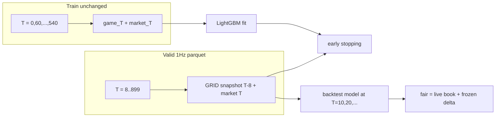

# Lag 8s in validation and backtest only

By your choice, **train stays as-is**: minute rows `0, 60, …, 540` with game and market at the same second (STRATZ minute leads, no playback required). The model is still fit on the aligned world.

**Validation and backtest** become the live GRID snapshot: at decision second `T`, market fields stay at `T`; clock + gold + XP + deaths come from `T − 8`. Early stopping and metrics can stay 1 Hz on that parquet. **Backtest signals are thinned to the GRID poll:** a new model delta at most every 10 s, 8 s stale; the book stays live.

Remaining skew (accepted): trees see aligned train, then are scored/traded on lagged valid.

## Feature `second` is T−8, not decision T

GRID `clock.currentSeconds` arrives in the same payload as net worth. Live you do not know "true" game time `T` independently of that snapshot. Feeding the model `second=T` while gold is from `T−8` would leak a clock the feed does not give.

So on validation/backtest the **model input** is:

- `second`, `radiant_nw_adv`, `radiant_xp_adv`, `deaths_*` = snapshot at `T − 8`
- `market_p_radiant` = live mid at `T`

The parquet **row key** stays decision `T`: `second` on `MarketSecondRow`, `state_ts_us`, 300s futures. Those mark when you quote, not what GRID printed.

Do not overwrite parquet `second` with `T−8` — window filters (`0..599` / `0..899`) and signal timestamps would shift by 8s.

Implement with one helper (e.g. next to `FEATURE_COLUMNS` in [`train_model.py`](dota_2_model/src/train_model/train_model.py), already imported by signals): copy `FEATURE_COLUMNS` and set `second = second - SOURCE_LAG_SECONDS`. Call it on validation fit, validation predict, and `build_match_signals`. Train still uses `train_dataset[FEATURE_COLUMNS]` unchanged.

## Constants

Add in [`src/shared/constants/dataset.py`](dota_2_model/src/shared/constants/dataset.py):

- `SOURCE_LAG_SECONDS = 8` — GRID snapshot age vs true game time
- `POLL_INTERVAL_SECONDS = 10` — new GRID/model tick

Do not change train grid, 300s horizon, or venue `seconds_delay`.

## Prepare: rewrite the validation join

Today [`join_validation_rows`](dota_2_model/src/prepare_dataset/prepare_dataset.py) zips STRATZ state and market row on the same `second`.

Change it to a lookup:

- Market row key remains decision `T` (`second`, `state_ts_us`, `market_p_radiant`, futures).
- Game fields from `states[T - SOURCE_LAG_SECONDS]`.
- Skip `T < 8`. First usable valid second is 8.
- Missing lagged state: fail closed.

Keep `filter_states_to_validation_window` as `0..899`; drop only early **market** rows. Train [`build_dataset_rows`](dota_2_model/src/prepare_dataset/prepare_dataset.py) is untouched.

## Backtest: delete signal lag, not zero it

Lag now lives in the parquet + feature helper. A second delay on `state_ts_us` would double-count.

Delete, do not keep for tests:

- `SIGNAL_LAG_SECONDS` in [`run.py`](dota_2_model/src/backtest/run.py)
- `lag_seconds` argument of [`build_match_signals`](dota_2_model/src/backtest/signals.py) — timestamps are `state_ts_us` only
- manifest key `signal_lag_seconds`
- `_lag{N}` suffix in `report_name`
- [`test_signal_lag_delays_asof_without_changing_delta`](dota_2_model/tests/test_backtest_signals.py) and every `lag_seconds=` kwarg

## Backtest: model every 10s, book always live

Live split: CLOB moves every tick; GRID/model at most every 10 s, and that snapshot is already ~8 s old. Age=10 alone is not enough — if a new row exists every second, age stays ~0.

Do both:

1. In [`build_match_signals`](dota_2_model/src/backtest/signals.py) keep only decision seconds `T = 10, 20, …` (skip `T < 10`; `T=8` is the first lagged valid row but not a poll). Each signal: game at `T−8`, `market_p` at that poll `T`.
2. Set `MAX_SIGNAL_AGE_SECONDS = 10` in [`signals.py`](dota_2_model/src/backtest/signals.py) so the last poll stays usable until the next. Today it is 5, which would go dark for half the interval.

The 1 Hz strategy timer stays. Between polls: `fair = live book + frozen predicted_delta`. Fills do not drop 10× — resting quotes still sit on the book. What updates every 10 s is the model delta, not quote permission.

Do not re-run the model every second with frozen gold and a new mid. That would be more CLOB-in-features than the dashboard (model loop on GRID poll only).

Keep the anchor gate (`dataset_market_p` is the poll-time mid; book may drift within 10 s — if that starts killing uptime, that is a real live effect, not a bug to paper over). Leave venue insert latency alone. `calculate_nw_deltas_30` uses lagged NW on both ends.

## Train script

[`train_model.py`](dota_2_model/src/train_model/train_model.py): train matrix unchanged; validation fit/predict go through the lagged-`second` helper. After `make prepare`, `make train` early-stops on the live snapshot.

## Tests and docs

- [`tests/test_prepare_dataset.py`](dota_2_model/tests/test_prepare_dataset.py): join is lookup `T → T-8`; `T < 8` dropped.
- Helper test: validation feature `second` equals parquet `second - 8`.
- [`tests/test_backtest_signals.py`](dota_2_model/tests/test_backtest_signals.py): signals only on the 10 s grid; as-of between polls reuses the last delta until age 10.
- Update [`.learnings/dota_2_model.md`](betting_workspace/.learnings/dota_2_model.md): train contemporaneous; valid rows 1 Hz with game at `T-8`; backtest model ticks every 10 s, `MAX_SIGNAL_AGE_SECONDS = 10`; no `SIGNAL_LAG_SECONDS`.

## Live dashboard (checked, not changing)

[`live_winprob_dashboard.py`](dota_2_model/src/live_dashboard/live_winprob_dashboard.py) is the old winprob UI; it does not import the current price-delta model (broken `shared` import). Data arrival is still the live contract to match:

- GRID Series State **every 10s**: `clock.currentSeconds`, `netWorth`, XP, kills/deaths in **one payload**. `build_features` takes `game_second` from that clock together with gold. No extra −8 on top — GRID already stamps the delayed clock.
- CLOB **every 1s** in a separate thread: display only. The old model never saw live `market_p_radiant` (only a pregame `prior_radiant`).

Historical join `game at T−8` + feature `second = T−8` **simulates that GRID payload** (STRATZ is true time; GRID is ~8s behind). Do not subtract 8 again when serving live: feed GRID as-is + current CLOB as `market_p_radiant`.

Backtest poll+age above matches the GRID/CLOB split. Dashboard itself stays out of scope (still not wired to the price-delta model; live serving must pass current CLOB as `market_p_radiant`).

Out of scope: editing the dashboard, market-data cache, lagged train / playback-only corpus, re-predicting every second on frozen gold + new mid.

## Verify

`make prepare` → `make train` → `make lint-all`. Focused pytest: prepare join, feature helper, backtest signals, train_model smoke.
