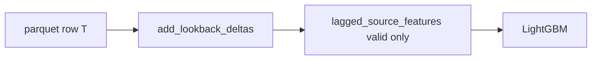

# Три фичи: прайор, mid за 60с, золото за 60с

Гипотеза одним прогоном: деревья видят, откуда стартовал рынок, куда уехал mid за минуту и куда уехало золото за минуту. Live mid уже фича и уже в лейбле — его не трогаем.

Не входит: xp/киллы за 60с, окна 10/30/120/300, `prior − mid` руками, `init_score`, шифт train на +8, крутить деревья, `make prepare`.

## Контракт фич

В [`src/train_model/train_model.py`](dota_2_model/src/train_model/train_model.py) заменить комментарий US-004 и список:

```python
FEATURE_COLUMNS = [
    "second",
    "radiant_nw_adv",
    "radiant_xp_adv",
    "deaths_radiant",
    "deaths_dire",
    "market_radiant_prior",
    "market_p_radiant",
    "radiant_nw_adv_delta60",
    "market_p_radiant_delta60",
]
```

`market_radiant_prior` уже есть в обоих паркетах. Дельты в TypedDict / prepare не пишем.

Тест [`test_column_contracts_track_typed_dicts`](dota_2_model/tests/test_train_model.py): `FEATURE_COLUMNS` больше не subset `TRAINING_COLUMNS` целиком. Проверять, что колонки без двух `*_delta60` лежат в паркете, а `signal_market_p_radiant_300s` по-прежнему не фича. Убрать assert «последняя колонка = `market_p_radiant`».

## Хелпер дельт

Рядом с `FEATURE_COLUMNS`, константа `FEATURE_DELTA_SECONDS = 60`.

`add_lookback_deltas(frame) -> DataFrame`: для каждой строки взять `radiant_nw_adv` и `market_p_radiant` той же `match_id` на `second - 60`, вычесть. Нет строки назад → `NaN` (не дропать, не заполнять первым значением). Знак сохранить. Не путать с [`calculate_nw_deltas_30`](dota_2_model/src/backtest/signals.py) (гейт BUY: модуль и fallback на первое золото).

Паттерн lookup как у `calculate_nw_deltas_30`: merge по `(match_id, second-60)`.

Вызвать **до** среза `FEATURE_COLUMNS` и **до** `lagged_source_features`:



- Train: минуты `0,60,…` → «60с назад» = предыдущая train-строка. На `second=0` оба NaN.
- Valid/бэктест: в паркете золото уже с `T−8`, mid с `T`. Lookup по ключу `second` даёт золото за 60с игры и mid за 60с рынка. Потом `second` в модели сдвигается на −8 как сейчас.

Точки вызова:

- [`train_model.main`](dota_2_model/src/train_model/train_model.py): train-кадр, `validation_fit`, `validation_prediction`
- [`build_match_signals`](dota_2_model/src/backtest/signals.py): на `rows` до `lagged_source_features`

`lagged_source_features` без изменений по смыслу: `frame[FEATURE_COLUMNS]` + `second -= 8`. Фикстуры тестов должны содержать новые колонки.

## Learnings

В [`.learnings/dota_2_model.md`](betting_workspace/.learnings/dota_2_model.md) строку «`market_radiant_prior` не фича и не `init_score`» заменить: прайор — фича; `init_score` по-прежнему нет; рядом `radiant_nw_adv_delta60` и `market_p_radiant_delta60` (lookback 60с по ключу parquet `second`, NaN если нет прошлого).

## Тесты

В `tests/test_train_model.py`:

- Train-кадр `0` и `60`: на `60` дельты = значение `60` − `0`; на `0` — NaN.
- Valid-кадр `T=8` и `T=68`: дельты = строка 68 − строка 8; на 8 — NaN.
- `lagged_source_features` сдвигает только `second`, дельты не трогает.

Фикстуры `FEATURE_COLUMNS` / fake booster в `tests/test_backtest_signals.py` подхватить новый список (колонки должны быть на кадре до predict).

## Проверка

`make lint-all` после правок Python. Фокус: `tests/test_train_model.py`, `tests/test_backtest_signals.py`.

После мержа плана в код: `make train` (prepare не нужен) и бэктест против текущего 6-фичевого `model.txt`. Смотреть гейты 2–3 цента, не 1. Деревья не крутить.
