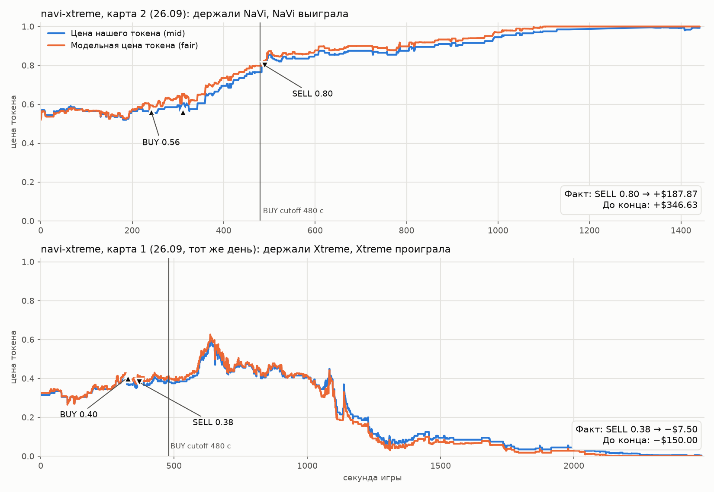
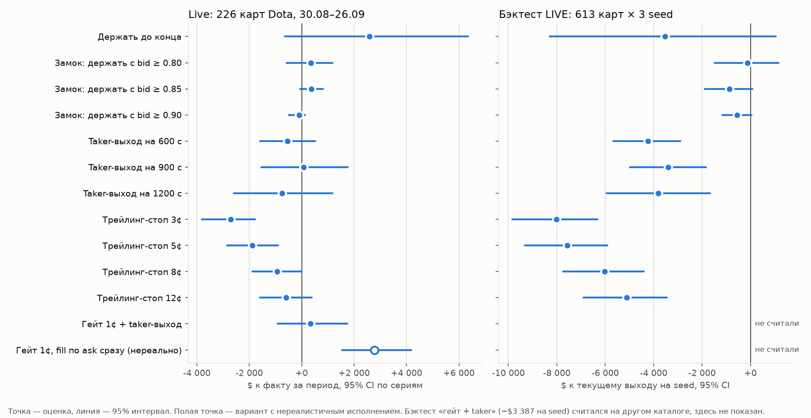

# Держать дольше? Live-выходы Dota, 26 сентября 2026

Проверено 26 сентября по локальной копии live-архивов и бэктесту LIVE. Разбор делали 4 агента herdr: `hold-grok` и `gap-grok` (Grok 4.7 High), `hold-devin` и `bt-devin` (SWE-2 High). Главные цифры по live и разрыв с бэктестом я пересчитал сам. Цифры бэктеста по 18 правилам и по LoL посчитали агенты, я их не пересчитывал.

**Вывод:**

1. На navi-xtreme game 2 удержание до конца дало бы +$346.63 вместо +$187.87. Это верно: +$158.76.
2. Бэктест, скорее всего, тоже продал бы эту карту по 0.80. На уровне 0.80 перед нашим SELL заявок не было, и покупатель прошёл через эту цену. Точно покажет реплей, когда приедут данные.
3. На всех 226 live-картах Dota с 30 августа удержание до конца дало бы +$2,583 к факту. 95% интервал по сериям: от −$638 до +$6,353. Ноль внутри, выгода не доказана.
4. Вся прибавка приходит с выигранных карт: +$9,677 на 146 картах. Проигранные 80 карт стоили бы −$7,093. Худшая карта стала бы −$400 вместо −$96.
5. На бэктесте (613 карт × 3 seed) удержание до конца теряет $3,527 на seed. Ни одно из 18 правил выхода не лучше текущего.
6. «В бэктесте много карт досиживают до конца» — это в основном июль, 11–13% карт. В сентябре бэктест довёз до конца 5–6% карт. На картах, общих с live, это 3 карты против 1, около $34.
7. Настоящий разрыв live и бэктеста — в цене продажи. На 48 общих картах бэктест заработал +$9.82 на каждые $100 покупок, live +$0.49.
8. Рекомендация: live-выходы не менять. Engine-бэктест новых правил выхода не запускать. Реплей navi-xtreme game 2 сделать, когда приедут Telonex и OpenDota.

## Три карты из вопроса и две проигранные рядом

| Карта | Наш токен | Факт | До конца | Разница |
|---|---|---:|---:|---:|
| `dota2-navi-xtreme-2026-09-26-game2` | NaVi, выиграла | +$187.87 | +$346.63 | +$158.76 |
| `dota2-aur1-ty-2026-09-25` (карта 3, рынок серии) | Yandex, выиграла | +$28.76 | +$48.66 | +$19.90 |
| `dota2-aur1-ty-2026-09-25-game2` | Yandex, выиграла | +$22.60 | +$39.93 | +$17.33 |
| `dota2-navi-xtreme-2026-09-26-game1` (тот же день) | Xtreme, проиграла | −$7.50 | −$150.00 | −$142.50 |
| `dota2-synaps-yes-2026-09-25` (разобрана отдельно) | Yellow Submarine, проиграла | −$56.43 | −$180.00 | −$123.57 |

На aur1-ty game 2 было два клипа. При удержании первого клипа второго не было бы: новый BUY ждёт, пока позиция закроется (`quoting.py:372`). Поэтому в таблице +$39.93. Оба клипа до конца дали бы +$83.65, но на это не хватило бы капитала.

## Почему navi продали по 0.80

SELL стоит на цене `max(ceil(ask), ceil(fair))`. Здесь fair — цена рынка плюс прогноз модели на 300 секунд (`signals.py:14-15`, `quoting.py:519-536`). Пока модель за наш токен, SELL стоит выше рынка, на модельной цене.

На navi модель держала SELL примерно на 3¢ выше рынка. Ядро поднимало SELL вслед за ценой: 0.73 на секунде 416, затем 0.75, 0.76, 0.77, 0.78, 0.79 и 0.80 на секунде 463. На уровне 0.80 других заявок не было. Между двумя обновлениями книги покупатель выкупил всё выше 0.77. Публичные сделки в этот момент идут по 0.79–0.82. Наши 793.76 акций ушли по 0.80.

Модель ждала +3.3¢ за 300 секунд. Токен дошёл до $1, это ещё +20¢ к цене продажи.

Такая продажа — самый частый случай. `hold-grok` разобрал 770 live-продаж:

| Тип продажи | Исполнений | Сколько эти токены добавили потом, до сеттла |
|---|---:|---:|
| На модельной цене выше ask: цена дошла до прогноза | 408 | +$3,550 |
| На ask: прогноз развернулся против нас | 360 | +$1,007 |
| Устаревший сигнал | 2 | +$35 |

Вторая колонка считает все проданные токены, включая проигравшие. Она показывает ощущение «продали рано» в долларах. Правилом выхода она не является: чтобы забрать эти деньги, пришлось бы держать и проигравшие позиции.

**Продал бы бэктест так же?** Скорее да (likely). Бэктест запускает тот же код стратегии и то же правило SELL. Модель очереди исполняет лимитный ордер, когда сделки проходят через его цену и очередь впереди съедена (`backtest/postprocess.py:68-71`). На navi очередь впереди была 0, и цена прошла через 0.80.

Есть одна оговорка. Бэктест считает на research-копии модели. Её прогноз на тех же данных может отличаться. На `dota2-lynx-synaps-2026-09-18-game2` research-модель ждала +3.5¢, а live-модель того дня (`20260915T105754Z`) +1.2¢. Бэктест держал SELL выше рынка, пропустил сделки по 0.80–0.81 и довёз позицию до $1. На navi у production-модели запас был около 3¢. Поэтому вероятнее продажа, но реплей может показать и удержание.

## Все live-карты: держать до конца или нет

Когорта: live-карты Dota с хорном от 30 августа, хотя бы одна покупка на Polymarket. Всего 226 карт в 121 серии, куплено на $43,170. Фактический результат +$933, худшая карта −$96, CVaR5 −$54. Строки Kalshi до 3 сентября исключены.

| Срез | Карт / серий | Добавка удержания к факту | 95% интервал | Худшая карта | CVaR5 |
|---|---:|---:|---|---:|---:|
| Все | 226 / 121 | **+$2,583** | от −$638 до +$6,353 | −$400 | −$277 |
| Наша сторона выиграла | 146 / 102 | +$9,677 | от +$6,809 до +$12,961 | | |
| Наша сторона проиграла | 80 / 63 | −$7,093 | от −$9,283 до −$5,176 | | |
| С 18 сентября | 98 / 50 | +$850 | от −$1,562 до +$3,499 | −$300 | −$251 |
| Текущая модель, с 24 сентября | 16 / 7 | +$37 | от −$727 до +$726 | −$300 | −$300 |

Три расчёта сходятся:

- `hold-grok`: +$2,583, интервал от −$638 до +$6,353.
- `hold-devin`, свой код: +$2,323, интервал от −$1,083 до +$6,048, CVaR5 −$294.
- Мой расчёт на 216 картах с известным победителем: +$1,899, это +$4.76 на каждые $100 покупок. Интервал: от −$3.95 до +$13.27 на $100.

Средняя добавка положительна, но не доказана. Удержание превращает бота в ставку на исход карты: каждая проигранная карта уходит в ноль. Прибавка сосредоточена: 87% её дают три серии (kalmy-lynx, nem-cs, navi-ks). Это посчитал `hold-devin`.

## Другие правила выхода

- **Трейлинг-стоп 3/5/8¢.** Теряет и на live, и в бэктесте, интервал ниже нуля. Стоп 3¢ выбил бы navi с результатом −$26.
- **Замок «держать до конца, когда bid ≥ 0.80 / 0.85 / 0.90».** На live +$356 / +$372 / −$99, интервал через ноль, медиана 0. Большинство карт до замка не доходит. В бэктесте −$120 / −$864 / −$551 на seed. Navi замок 0.80 не спас бы: SELL исполнился при bid 0.79.
- **Taker-выход в 600 / 900 / 1200 секунд.** На live шум: −$546 / +$68 / −$742. В бэктесте −$4,231 / −$3,392 / −$3,801 на seed.
- **Гейт 1¢ и taker-выход.** Не продавать, пока модель ждёт роста больше 1¢. Потом сразу продать по bid. На live +$328, интервал от −$925 до +$1,742. Медиана −$0.65, CVaR5 −$75, это хуже факта. С учётом глубины книги `hold-devin` получил −$352. В бэктесте −$3,387 на seed.
- **Гейт 1¢ с мгновенным исполнением по ask.** Это единственный вариант с интервалом выше нуля: +$2,772, от +$1,532 до +$4,189. Но допущение нереально. За 15 секунд bid доходит до нашего ask только в 79 случаях из 374.

Про клип $150 × 3. Taker-выход такого размера в 85% случаев проходит больше одного уровня книги. В среднем он теряет 2.9¢ на акцию к лучшему bid. Это посчитал `hold-devin`. Это ещё один довод против taker-правил.

## Почему гейт 23 сентября проиграл на Dota

Гейт с реалистичным исполнением почти совпадает с удержанием до конца. `hold-grok` проверил: консервативный SELL гейта не исполнился ни в одном из 383 эпизодов live.

`bt-devin` разложил engine-результат гейта (`…_p35_sell-gate` против `…_p35_default`, 3 seed, сумма):

| Канал | Dota | LoL |
|---|---:|---:|
| Позиции доехали до сеттла и выиграли | +$12,838 (274 карты-seed) | +$11,583 |
| Позиции доехали до сеттла и проиграли | −$1,068 (6) | −$4,501 |
| Без сеттла, результат лучше | +$3,854 (213) | +$26,590 |
| Без сеттла, результат хуже | **−$15,558 (434)** | −$21,650 |
| Итого до ребейта | +$67 | +$12,021 |

Dota проиграла не на проигравших позициях до сеттла. Она проиграла на позднем выходе. Гейт держит позицию, пока прогноз выше 1¢. Когда модель сдаётся, maker SELL встаёт хуже, чем ранняя продажа обычного правила.

На LoL тот же канал в плюсе. Но live LoL это не подтверждает. На 214 live-картах LoL гейт с taker-выходом даёт −$328, интервал от −$620 до −$50. С 18 сентября все варианты на LoL ≤ 0.

## Бэктест и live: где разрыв на самом деле

Я проверил долю карт, которые доезжают до сеттла в бэктесте. Это 35–37 карт на seed (8.7–9.2% торгуемых). Все они прибыльные и дают больше половины прибыли бэктеста.

По месяцам картина другая:

| Месяц | Доля карт до сеттла | Прибыль этих карт, seed 0 |
|---|---:|---:|
| июнь | 6% | $281 |
| июль | 11–13% | $815 |
| август | 6–10% | $492 |
| сентябрь | 5–6% | $81 |

На картах, общих с live (107 карт, 30 августа – 20 сентября), бэктест довёз до сеттла 3 из 61 торгуемой карты. Это +$57 из +$741. Live довёз 1–3 карты из 107: число зависит от источника, `session_end` или сумма исполнений.

Почему все такие карты прибыльные. Пока модель за наш токен, SELL стоит выше ask. На плавном росте сделок по нашей цене нет, и SELL уходит вверх вслед за рынком. В конце карты ядро снимает все ордера (`quoting.py:960-963`), и позиция гасится по $1. При падении прогноз разворачивается, SELL встаёт на ask и исполняется.

**Настоящий разрыв — в цене продажи.** Сравнение на 48 общих картах с 4 сентября (38 серий):

| | Live | Бэктест, seed 0 |
|---|---:|---:|
| Результат на $100 покупок | +$0.49 | +$9.82 |
| Разрыв в долларах бэктеста | | +$568, интервал от +$210 до +$982 |
| Из него: карты, закрытые в обоих мирах | | +$534 |
| Из него: карты до сеттла | | +$34 |

Бэктест продаёт дороже: медиана +2.7¢ на акцию на 38 картах с одной стороной сделки (`gap-grok`: +4.6¢ на 50 картах). Покупает он по той же цене.

Причины я проверил частично:

1. Другая модель. Бэктест гоняет research-модель `20260924T183856Z` по картам, которые live торговал старыми моделями (`20260825…` – `20260919…`). У неё прогноз больше, и SELL стоит выше.
2. Другие настройки. Live торговал с cutoff 540 на 59 из 71 карты с трейсом, на `follow300-v4` на 34 из 71, клипом от $5 до $100.
3. Только в live SELL замораживается при MATCHED (`trader/session_core.py:329`), в бэктесте флаг выключен (`backtest/strategy.py:263`). В разобранных случаях он не решал.

Доли причин не измерены. Вывод: на этих картах бэктест завышает прибыль выхода примерно на $9 на каждые $100 покупок. Честное сравнение возможно только на картах с 24 сентября: одна модель, `follow300-v5`, cutoff 480.

## Что делать

1. Не менять live-выходы. Удержание, замки, стопы и гейт не дают доказанного плюса, а хвост растёт.
2. Не запускать engine-бэктест этих правил. Офлайн-проверка на 613 картах × 3 seed показала: ни одно правило не лучше текущего. Лучшее, замок 0.80, даёт −$120 на seed.
3. Когда приедут Telonex и OpenDota за 26 сентября, прогнать `9017299527` в бэктесте. Если бэктест продаст по 0.80, вопрос «бэктест довёз бы до конца» закрыт.
4. Сравнить live и бэктест на картах с 24 сентября. Если бэктест и там продаёт на 3–5¢ дороже, разбирать модель очереди и `sell_unconfirmed`.
5. Через 2–3 недели перезапустить `hold-grok/02_cf.py` на новых live-картах. На текущей модели сейчас 16 карт и 7 серий. Там гейт с taker-выходом даёт +$662, интервал от −$51 до +$1,445. Этого мало для решения.

## Где агенты разошлись

- `hold-devin` советует один engine-прогон «гейт, потом maker-SELL с ожиданием и taker». Я с этим не согласен. Реалистичные варианты гейта на live дают около нуля: +$328 у `hold-grok`, −$352 у `hold-devin` с глубиной книги. В бэктесте taker-вариант даёт −$3,387 на seed. Maker-вариант движок уже прогонял 23 сентября.
- Удержание до конца: +$2,583 у `hold-grok` против +$2,323 у `hold-devin`. Разница в сборке эпизодов. Оба интервала включают ноль.
- `hold-grok` сначала потерял мелкие BUY на 13 картах: позиция меньше 5 акций считалась пылью. Я нашёл это на aur1-ty m3. После исправления удержание выросло с +$2,555 до +$2,583.

## Опровергнуто или не подтверждено

- «Держать до конца выгоднее» — на live не доказано, в бэктесте −$3,527 на seed.
- «Бэктест довёз бы navi до конца» — скорее нет.
- «Разрыв с бэктестом — в картах до сеттла» — нет, он в цене продажи.
- «Трейлинг-стоп сохранит рост и срежет провалы» — нет, теряет на обоих наборах.
- «Гейт 23 сентября проиграл из-за проигравших позиций до сеттла» — нет, из-за позднего выхода.
- «Live LoL подтверждает +83% гейта» — нет.
- Моя ошибка в задании агентам: при устаревшем сигнале SELL не встаёт на ask, а снимается (`quoting.py:810-811`, `:103-108`). Это нашёл `gap-grok`.

## Проверки и источники

Я пересчитал сам:

- три карты из вопроса и navi-xtreme game 1 по `session.jsonl`;
- удержание до конца на 216 картах с известным победителем (`h2e.py`);
- долю карт до сеттла в бэктесте по месяцам и на общих с live картах;
- разрыв на 48 общих картах: +$567.7, интервал от +$210 до +$982;
- хронологию SELL на navi по `core_trace.jsonl`;
- гейт с taker-выходом без глубины книги: +$788, интервал от −$493 до +$2,218 (`gate_taker.py`);
- правила выхода в коде: `quoting.py`, `signals.py`, `policy.py`.

Отчёты агентов:

- [hold-grok: live, все правила](../../.analysis/hold-longer-2026-09-26/reports/hold-grok.md)
- [hold-devin: live, второй расчёт и LoL](../../.analysis/hold-longer-2026-09-26/reports/hold-devin.md)
- [gap-grok: live против бэктеста](../../.analysis/hold-longer-2026-09-26/reports/gap-grok.md)
- [bt-devin: бэктест и разбор гейта](../../.analysis/hold-longer-2026-09-26/reports/bt-devin.md)
- [Мои заметки и скрипты](../../.analysis/hold-longer-2026-09-26/work/orchestrator/notes.md)
- [Эксперимент sell-gate 23.09](../../../esports-trader/docs/experiments/sell-gate-held-delta.md)
- [Правила котирования](../../../esports-trader/src/strategy/quoting.py)

Код, конфигурация и процессы live-трейдера не менялись.
