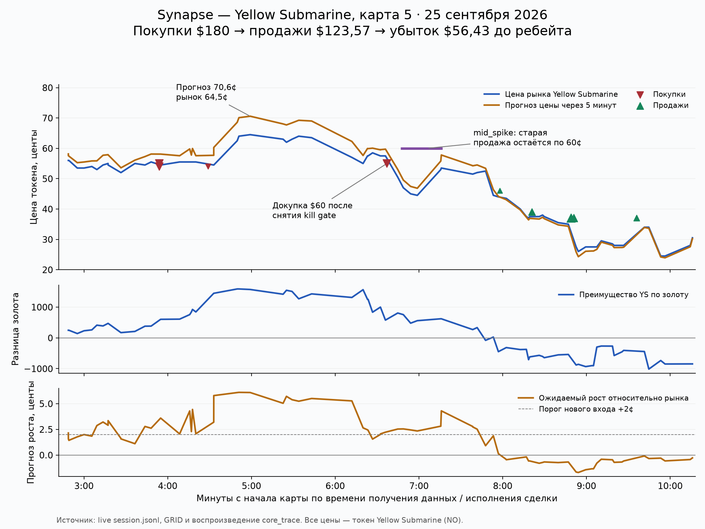

# Synapse — Yellow Submarine, 25 сентября 2026

Проверено 26 сентября по live-архиву VPS и идентичной локальной копии. Основной убыток относится к пятой, решающей карте: `grid-3010626-m5`, рынок `dota2-synaps-yes-2026-09-25`. На ней рынок победителя серии эквивалентен победителю карты при счёте 2:2. NO = Yellow Submarine = Radiant; YES = Team Synapse = Dire. Победил Synapse.

**Вывод:** убыток объясняется ошибкой прогноза и правилами набора/выхода. В проверенном исполнении стратегии расхождений и зависшего выхода не обнаружено. Kill gate работал, но после получения данных о смерти разрешал снова покупать. Он устраняет короткий разрыв между табло и данными модели; продолжение плохого для команды отрезка он не запрещает.

## Деньги

| Показатель | Значение |
|---|---:|
| Куплено NO | 329,285870 токена |
| Затрачено | $179,996170 |
| Средняя покупка | 54,6626¢ |
| Продано NO | 329,277672 токена |
| Получено | $123,569400 |
| Средняя продажа | 37,5274¢ |
| Результат по сделкам | **−$56,426770** |
| Расчётный maker rebate | около +$1,1905 |
| Результат с расчётным rebate | **около −$55,2362** |

Остаток 0,008198 NO после последнего исполнения — проигравшая пыль; в `session_end` позиция уже обнулена. Это закрытый торговый убыток, а не деньги, зависшие в выигрышном токене. Все девять исполнений — maker.

На карте 2 результат +$9,9162 с расчётным rebate; карты 1, 3 и 4 без исполнений. Сумма по пяти картам серии — примерно −$45,32 с расчётным rebate. Это не результат всего кошелька за день и не проверка фактически выплаченного rebate.

Размер `$60` в этой сессии — **на один уровень**. Заголовок фактического `core_trace` фиксирует три уровня по $60, то есть до $180 в эпизоде. Лимит этого эпизода соблюдён. Уменьшение до $60 на всю трёхуровневую позицию означало бы $20 на уровень; текущая настройка этого не делает.

## Как развивалась позиция

В таблице ниже время — `second` игрового сигнала. Его нельзя использовать для точного порядка сделок и убийств: данные GRID задержаны, а `fill.second` записывается при журналировании. Точный порядок ниже восстановлен по UTC и монотонному времени ядра.

| Сигнал | Рынок NO | Прогноз NO через 300 секунд | Прогноз изменения | Ситуация |
|---|---:|---:|---:|---|
| 3:42 | 55,5¢ | 58,11¢ | +2,61¢ | Последний сигнал перед первыми покупками |
| 4:53 | 64,5¢ | 70,58¢ | +6,08¢ | YS ведёт по золоту на 1 570, счёт убийств 3:2 |
| 6:30 | 57,5¢ | 59,72¢ | +2,22¢ | Преимущество по золоту только 576, убийства уже 3:6; разрешена последняя докупка |
| 6:42 | 47,0¢ | 49,54¢ | +2,54¢ | Прогноз ниже 50¢, но всё ещё ожидает рост относительно рынка |
| 7:50 | 44,0¢ | 44,13¢ | +0,13¢ | Преимущество по золоту стало −449, убийства 3:8 |
| 7:56 | 43,5¢ | 43,04¢ | −0,46¢ | Ожидаемое движение стало отрицательным; убийства 4:9 |

Сначала, в 18:42:55 UTC, куплено на $114,58587 по 55¢ и 54¢. В 18:43:30 добраны ещё $5,4108 по 54¢. На росте рынка до 64,5¢ оценка этой позиции по mid была примерно **+$22,03**. Это оценка, а не доказательство возможности немедленно продать весь объём по этой цене.

Почему прибыль не зафиксировали: выход привязан к прогнозу. Продажа выставляется не ниже модельной цены, если та выше рыночного ask. При прогнозе около 70,6¢ стоял SELL по 71¢, а bid/ask рынка был 64/65¢. Доступной прибыли стратегия предпочла ожидание дальнейшего роста. Отдельного правила фиксации этой накопленной прибыли в данном эпизоде нет.

Последние $59,9995 куплены в 18:45:38 по 55¢, уже после трёх быстрых смертей YS. Совокупная позиция стала почти $180. Продажи начались в 18:46:59 по 46¢; основной объём вышел по 39¢ и 37¢, последняя продажа — в 18:48:37. До конца карты позицию не держали.

## Что именно сделал kill gate

Ключевой эпизод, UTC:

| Время | Событие |
|---|---|
| 18:45:16,078 | Раннее табло сообщает смерть YS, gate закрывается |
| 18:45:16,179 | BUY `c61` по 55¢ отменяется с причиной `kill` |
| 18:45:19,499 | Следующая смерть продлевает ожидание данных |
| 18:45:27,797 | Модельный сигнал подтверждает пять смертей YS; gate снимается |
| 18:45:27,850 | Снова выставлен BUY `c62` по 55¢ |
| 18:45:28,896 | Раннее табло сообщает шестую смерть YS |
| 18:45:28,925 | BUY `c62` отменяется с причиной `kill` |
| 18:45:37,038 | Модельный сигнал подтверждает шестую смерть; gate снимается |
| 18:45:37,110 | Снова выставлен BUY `c64` по 55¢ |
| 18:45:38,082 | BUY исполняется: 109,09 токена, почти $60 |

Таким образом, последняя покупка произошла примерно через **1,04 секунды после снятия gate**, а не из-за проигранной отмены. При снятии gate модель уже видела счёт 3:6 и всё равно прогнозировала +2,22¢. Обновление счётчика смертей с 5 до 6 в двух соседних сигналах само по себе вообще не изменило этот прогноз.

За карту записано 54 `KillGateUpdate`; до окончания торговой активности gate инициировал семь уникальных отмен: шесть BUY и один SELL. Поэтому строка `entry_block=kill` в 99 модельных/служебных сигналах — не число предотвращённых покупок и не число убийств.

Есть ограничение источника данных: позднее часть обновлений табло пришла с возрастом **16,45 / 47,06 / 32,30 секунды**. Они по правилу `age >= 9s` не открывали ранний gate; модельная таблица уже успевала сообщить эти смерти раньше табло. Это корректный пропуск устаревшего маркера, но показывает, что быстрый канал не всегда быстрый. В эти моменты новых покупок уже не было.

## Остальные барьеры

| Барьер | Фактическое поведение |
|---|---|
| Минимальный прогноз движения | Включение при 2¢, выключение ниже 1,5¢. Сработал, шесть BUY отменены с `min_delta`. Это гистерезис: уже открытый допуск может сохраняться между 1,5¢ и 2¢. |
| Kill gate | Работал, детали выше. После подтверждения смерти допускает возврат к прежнему направлению. |
| `mid_spike` | Падение ≥10¢ за 10 секунд запускает паузу минимум 30 секунд. Первая пауза 18:45:47,759–18:46:17,869 началась уже после набора $180. |
| Поведение SELL во время `mid_spike` | Существующий SELL остаётся на прежней цене; новые котировки не создаются. В первую паузу стоял SELL по 60¢ на 220,19 токена, при общей позиции 329,29. Это не принудительная ликвидация и не стоп-лосс. |
| Время входа | Cutoff 480 секунд соблюдён; последняя покупка — при сигнале 390. После cutoff продажа разрешена. |
| Цена и спред входа | Порог цены 40¢, потолок 85¢, запрет спреда от шести тиков. Покупки по 54–55¢ эти ограничения проходили. Порог 40¢ не запрещает последующую продажу дешевле. |
| Бюджет | Три уровня по $60, суммарные покупки $179,99617. Переполнения эпизода нет. |
| `lonely-L0` | Две отмены одинокой верхней заявки подтверждены. |
| Устаревший сигнал | Две отмены BUY с `stale_signal` до окончания торгов; фактические лимиты свежести из заголовка: вход 16 секунд, выход 45 секунд. |
| Скорость изменения золота | **В этой версии отсутствует.** Удалена коммитом `2b1ae180` от 20 сентября, одновременно с переходом на 2¢/1,5¢. Упоминание `nw_velocity=350` в VPS skill устарело. |

Глобального `halt` во время набранной позиции нет. Лимиты кошелька и запреты новых входов не эквивалентны закрытию конкретной позиции при убытке $60.

Заморозку SELL при `mid_spike` нельзя автоматически назвать вредной: во вторую паузу старые продажи по 37¢ остались выше упавшего рынка и часть объёма действительно исполнилась. Изменение этого поведения требует сравнения по многим матчам с учётом исполнений.

## Почему прогноз менялся

Модель `20260924T183900Z` — ансамбль десяти деревьевых моделей, прогнозирующий **изменение цены за 300 секунд**. Итоговая цена = текущая цена рынка + прогноз изменения. Она не выдаёт калиброванную уверенность в правильности сделки; 70,6¢ не означает «модель на 70,6% уверена, что сделка прибыльна».

На пике YS действительно имел +1 570 золота, преимущество самого богатого игрока +357 и убийства 3:2. Затем золото сократилось до +576 при 3:6, а к 7:50 стало −449 при 3:8; преимущество по опыту сменилось на −1 880. Прогноз ожидаемого движения постепенно снизился с +6,08¢ до +0,13¢, затем стал отрицательным.

Большая часть заметного падения модельной цены была прямым следствием рыночного падения. Между 4:53 и 7:50 прогноз цены упал на 26,45¢: 20,5¢ составило изменение входной цены рынка, 5,95¢ — изменение собственного прогноза движения. Поэтому пересечение модельной ценой 50¢ на 6:42 ещё не было сменой торгового направления: относительно рынка 47¢ модель продолжала ожидать +2,54¢.

126 прогнозов из торгового отрезка и ближайшего продолжения повторно рассчитаны из исходного GRID через ту же production-модель. Максимальное расхождение с записанным raw delta: 2,1×10⁻¹⁷. Ошибки ориентации команд, подмены модели или воспроизведения её входов на этих точках не обнаружены.

Для уточнения влияния признаков выполнено точное разложение изменения прогноза по шести группам признаков через все 64 комбинации старых и новых значений. Между 4:53 и 7:50 группа командного золота объясняет −5,32¢ изменения raw delta, опыт −1,27¢; остальные группы суммарно частично компенсируют это падение. Это объяснение вычисления модели на двух снимках, не доказательство причинности в игре. Отдельный счётчик смертей в таком разложении не обязан иметь ожидаемый человеком знак.

## Что проверять, чтобы уменьшить подобные убытки

1. **Повторную докупку после серии смертей.** Здесь защита сняла BUY, но вернула его сразу после обновления таблицы, когда модель всё ещё предпочитала YS. Проверить дополнительную паузу/запрет докупки при серии смертей и ухудшении золота, независимо от завершения синхронизации GRID. Это отдельное правило; просто увеличение максимальных 10 секунд не помогло бы, пока раннее снятие по подтверждённым смертям остаётся прежним.
2. **Выход при исчезновении ожидаемого роста.** Проверить частичную фиксацию прибыли, ограничение возврата накопленной прибыли и более быстрый выход при ухудшении прогноза. В этой карте уже была положительная оценка позиции, но текущая стратегия продолжала поднимать цену продажи вслед за прогнозом. Параметры следует выбирать по отложенной выборке, не по этому красивому пику.
3. **Разделение запрета BUY и ведения SELL при `mid_spike`.** Проверить варианты, позволяющие уменьшать позицию/обновлять её продаваемый объём во время паузы. Сравнить и убытки, и потерянную прибыль при отскоках; здешняя заморозка иногда помогала исполниться дороже рынка.
4. **Явный предел суммарной позиции.** Масштабирование позиции уменьшает долларовую тяжесть ошибочного прогноза. Нынешние $60 на уровень допускают примерно $180 риска капитала в эпизоде; это надо отличать от намерения рисковать всей позицией на $60.

Один проигрыш возможен и у положительной стратегии. По одному матчу нельзя доказать ни её общую пригодность, ни то, что новый стоп или cooldown улучшит результат. Однако называть конкретные −$55 полностью неизбежными тоже нет оснований: здесь видны проверяемые решения стратегии — повторная докупка после плохой серии и ожидание модельной цены вместо сокращения позиции. Для сравнений нужны одинаковые матчи, реалистичные исполнения, комиссии, перебор нескольких seed и проверка на данных, не использованных для выбора правила.

## Проверки и источники

- `summarize.py --match` выполнен на VPS для всех пяти карт; денежные итоги взяты из штатной сводки, сверены с fill/session_end.
- SHA-256 локальных `session.jsonl`, `core_trace.jsonl`, `grid_state.jsonl` совпадает с VPS.
- Полное воспроизведение ядра: **92 976 событий, 0 несовпадений планов**, все группы состояния в конце совпадают; `VERDICT: OK`.
- Детальное воспроизведение до 10:50: **26 922 события, 0 несовпадений планов, таймеров и digests**. Максимальное наблюдавшееся ожидание SELL-cancel около 0,108 секунды, SELL-placement около 0,303 секунды. Признаков зависания выхода в убыточном отрезке нет.
- Старые docker-логи за матч текущий контейнер не вернул. Выводы опираются на сохранённые архивы и политику из их заголовка, а не на предположение о времени последнего рестарта.
- Проверка интерпретирует исполненные сделки и решения; альтернативная стратегия с иной очередью заявок не симулировалась. Её точный PnL неизвестен.

Исходники и доказательства:

- [Метаданные карты](../../../esports-trader/data/trader/grid-3010626-m5/match.json)
- [Сделки и сигналы](../../../esports-trader/data/trader/grid-3010626-m5/session.jsonl)
- [Полный журнал ядра](../../../esports-trader/data/trader/grid-3010626-m5/core_trace.jsonl)
- [Исходный GRID](../../../esports-trader/data/trader/grid-3010626-m5/grid_state.jsonl)
- [Production-модель](../../../esports-trader/data/new_model/production/model.json)
- [Правила котирования и защит](../../../esports-trader/src/strategy/quoting.py)
- [Исследование kill gate](../../../esports-trader/docs/experiments/kill-gate.md): исторически gate уменьшал долю убыточных карт, но даже в этом исследовании оставлял около 24,5% убыточных среди торгуемых карт Dota. Это описание того эксперимента, а не оценка вероятности убытка текущего live-процесса.

Код, конфигурация и процессы live-трейдера в ходе разбора не менялись.
