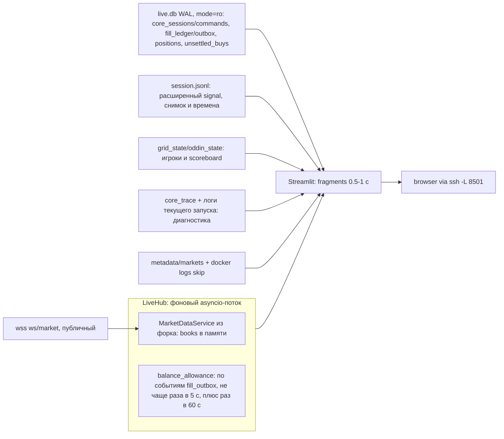

<!-- de3ced24-c49a-4984-91bf-99fa958082dc -->
---
todos:
  - id: "signal"
    content: "Обязательно расширить существующий signal: recorded_at_utc, feed_source, feed_received_at_utc, game_snapshot, model_evaluated, raw_delta; сохранить исходное время таблицы при board-реакциях, проверить отсутствие старого Δ и дополнительных вызовов модели/записей"
    status: pending
  - id: "deps"
    content: "Группа dashboard в pyproject, таргет make dashboard, .streamlit/config.toml (тема, 127.0.0.1)"
    status: pending
  - id: "move-summarize"
    content: "Перенести summarize.py в esports-trader/src/dashboard/summarize.py (stdlib-only, корень от __file__, ограниченная полная выборка activity/positions с учётом мелких остатков и self-check), удалить копию в betting_workspace, обновить пути в SKILL.md и log-map.md"
    status: pending
  - id: "hub"
    content: "src/dashboard/live_hub.py: один hub на процесс, безопасные снимки для UI, блокирующий HTTP вне WS-loop, баланс по matched/failed/direct confirmed из fill_outbox (не чаще раза в 5 с) плюс раз в 60 с, доступный резерв по правилам трейдера без двойного учёта"
    status: pending
  - id: "sources"
    content: "src/dashboard/sources.py: read-only live.db (core_sessions, core_commands, bindings, fill_ledger, fill_outbox, positions, unsettled_buys), небольшой хвост с mtime-кэшем, классификация активных/завершённых/потерявших фид карт, sidecars + docker skip, словарь причин; дневной PnL и ребейт импортом из dashboard.summarize"
    status: pending
  - id: "game-state"
    content: "Компактная игровая сводка из расширенного signal, 5+5 игроков и scoreboard из существующих архивов: Dota GRID/Oddin, LoL GRID; раздельная свежесть board и model table, переиспользование парсеров watcher"
    status: pending
  - id: "diagnostics"
    content: "Всегда видимая строка HALT/SELL/feed/model/order/BUY-reserve с временем и доказательством; нормальные блокировки и dust не объявлять багами; подробности и полный replay только по запросу"
    status: pending
  - id: "fresh"
    content: "render_fresh: «нет данных», «свежий», «обновляется», «устарел» с отдельными порогами для баланса/PnL, ожиданием snapshot по токену и отметкой неполной выборки; ошибки не превращаются в нули"
    status: pending
  - id: "home"
    content: "Главная: полоса кэш/PnL/ребейт/здоровье, торгуем сейчас с причиной отсутствия BUY и возрастом данных, не торгуем с причиной, закрытые сегодня и остатки завершённых карт"
    status: pending
  - id: "match"
    content: "Страница игры: строка «сейчас», почему не покупаем, возраст данных и источник фида, стакан с подтверждёнными live и отдельными pending/canceling/unknown, позиция и PnL, plot_match, лента событий, ссылка Polymarket и соответствие YES/NO командам"
    status: pending
  - id: "test"
    content: "tests/test_dashboard.py: резервы без двойного учёта, задержка выхода 30 с, классификация карт, свежесть и failed fill, полная/неполная пагинация и мелкие остатки, чтение ro SQLite"
    status: pending
  - id: "docs"
    content: "Строка о запуске и SSH-туннеле в vps-trader SKILL.md"
    status: pending
isProject: false
---
# Live dashboard трейдера

## Принципы
- Дашборд — отдельный процесс, который только читает. В `src/trader` в рамках этого плана обязательно расширяем существующую запись `signal` и передачу диагностических полей в неё; состав полей и файлов зафиксирован ниже. Стратегия, исполнение ордеров и денежный учёт остаются прежними. `poly-maker` не меняем.
- Дашборд не вмешивается в движок, но CPU, память, диск и лимиты API по IP общие: отсутствие влияния проверяем замером. Когда браузер закрыт, перерисовок нет; остаются фоновые задачи hub, включая WS, опрос баланса и пятиминутную свёртку. Когда дашборд не нужен, процесс выключается из tmux. `nice -n 10` снижает приоритет CPU, но не ограничивает память.
- Слушает только `127.0.0.1:8501`. С ноутбука открывается так: `ssh -L 8501:localhost:8501 sun`, затем `localhost:8501` в браузере.
- Максимальное переиспользование: `viewer.live_tape` (`list_live_matches`, `load_live_tapes`), `viewer.plot.plot_match`, `trader.collector_sidecars.scan_sidecars`, `trader.core_persistence` (`get_session`, `decode_checkpoint`, `list_bindings`, функции резервирования), форковые `MarketDataService` и `OrderBook`, `py_clob_client_v2`. Новый код дашборда — склейка, UI и перенос дневной PnL- и rebate-логики из `summarize.py`; правка трейдера ограничена расширением `signal`.
- Источники для состояния игры и диагностики — архивы именно работающего трейдера и его read-only база. Не запускаем сетевые watcher-скрипты из дашборда и не создаём отдельное соединение GRID/Oddin: оно могло бы показывать другой, более свежий снимок. Независимый публичный WS нужен только для отображения стакана, с явной подписью источника.
- Первая версия остаётся простой: кэш по `(path, mtime_ns, size)` с ограниченным числом записей, небольшой хвост для текущего состояния, полное чтение истории выбранной карты при открытии/редком обновлении графика раз в 15 с. Полный разбор выбранного архива по запросу пользователя допустим для диагностики, без перечитывания всех архивов на каждом быстром обновлении. `list_live_matches` не является фильтром незавершённых карт и читает историю: не вызываем его на каждом обновлении стакана; список и классификацию кэшируем на 60 с. Чтение новых строк по смещению не вводим без замера, который покажет необходимость. Чтение файлов не меняет их `mtime`; процесс gzip и его правила остаются прежними.

## Обязательное расширение существующего `signal`
Реализуем первым, до подключения игровой сводки. Все новые поля добавляем в ту же строку `kind=signal` файла `session.jsonl`:

| Поле | Что записываем |
| --- | --- |
| `recorded_at_utc` | UTC-время формирования журнальной записи; это время signal, а не получения фида. |
| `feed_source` | Источник исходного `FeedEvent`: `grid` или `oddin`, в существующем формате `FeedSource`. |
| `feed_received_at_utc` | Исходное `FeedEvent.received_at_utc` принятого игрового снимка. При повторном решении от изменения стакана сохраняем это время. |
| `game_snapshot` | Поля того же `GameSnapshot`, который передан в расчёт этого решения: `second`, `server_timestamp`, `phase`, `paused`, `radiant_nw_adv`, `radiant_nw`, `dire_nw`, `radiant_xp_adv`, `deaths_radiant`, `deaths_dire`; вложенный `top` содержит `top1_nw_adv`, `radiant_top1_nw_ratio`, `dire_top1_nw_ratio`, `top3_nw_adv`, `radiant_top3_nw_ratio`, `dire_top3_nw_ratio`. |
| `model_evaluated` | `true`, только когда `predict_fair` успешно вернул прогноз для этого решения; при пропуске или ошибке — `false`. Причина остаётся в существующем `reason`. |
| `raw_delta` | `prediction.raw_delta` именно этого успешного расчёта, в существующей системе сторон модели; при `model_evaluated=false` — `null`. Кэшированный `_last_raw_delta` предыдущего расчёта сюда не подставляем. |

- Передаём метаданные исходного события и результат текущего расчёта через `SignalDecision` в `SessionJournal.write_signal`. Модель повторно не вызываем. Существующие поля `signal` и их смысл сохраняем. `game_snapshot` — игровой снимок решения, а не полный вектор признаков: историю, сырых игроков и полный набор из 70/81 признака модели в каждую строку не копируем. При `model_evaluated=false` интерфейс не утверждает, что модель рассчитала прогноз на этом снимке.
- `entry_block` остаётся предварительной причиной BUY на момент решения: `signal` пишется до пробуждения quoter. Он не является подтверждённым планом ядра, причиной отсутствия SELL или актуальным HALT между сигналами. Текущие ордера, позиции и сохранённые флаги ядра читаем из базы; остальные режимы и разрешения — как последнее доказанное состояние из логов текущего запуска и trace с их временем. Полный replay ядра остаётся отдельным действием пользователя. Последнюю строку буферизованного trace без проверки сохранения/rollback не объявляем подтверждённым состоянием.
- Порог, cutoff, clip, лимиты и модель работающей сессии читаем из существующих заголовков session/trace. Текущий TOML не выдаём за параметры уже работающей сессии. Недостающие сведения старых архивов отображаем как неизвестные.
- Добавляем поля к существующей записи: число строк, flush/fsync и вызовов модели не увеличиваем; новых файлов состояния, фоновых экспортёров, сетевых запросов и изменений checkpoint/денежной схемы нет. Проверяем размер строки и задержку существующей записи на репрезентативном потоке.
- Старые архивы без новых полей читаются без ошибки: точное время signal и модельный Δ показываем как неизвестные. Данные, реконструированные из фида, отдельно подписываем; не выдаём их за доказанный снимок конкретного вызова модели.

## Поток данных

## Что читаем с диска (без сети, без блокировок)
- `data/trader_live/wallet/live.db` открываем `sqlite3.connect("file:...?mode=ro", uri=True)` в autocommit. База в WAL (`StateStore` форка ставит `journal_mode=WAL`, `WalletStateStore` наследует), поэтому чтение не блокирует запись трейдера. Только короткие SELECT; согласованную read-транзакцию для связанных таблиц завершаем сразу после выборки, до расчётов и рендера, чтобы не удерживать WAL. `immutable=1` не используем.
- Ордера глазами трейдера: каждые 0.5 с дешёвый `SELECT session_id, condition_id, revision, updated_at FROM core_sessions`. Когда `updated_at` изменился, читаем снимок через `trader.core_persistence.get_session` и `decode_checkpoint`. В `checkpoint.orders` есть `side`, `price`, `submitted_qty`, `filled_qty`, `status` (`pending`/`live`/`canceling`/`unknown`/`gone`), `cancel_reason`. Флаги `sell_only` и `recovery_pending` показываем как состояние ядра. Снимок пишется при каждом `apply_and_persist` и `consume_core_outbox`.
- Сделки: `fill_ledger` (MATCHED/CONFIRMED, цена, размер, maker, время), фильтр по токенам карты. Изменения читаем по `fill_outbox.seq` (индексированный `seq > last_seq`), включая `failed`; на старте hub берём текущую границу seq вместе с исходным снимком и отдельно запрашиваем баланс, без повторного проигрывания всей истории; подтверждение уже учтённого MATCHED не считаем новой сделкой. SUPERSEDED/FAILED не включаем в активные fills.
- Резервы: `core_commands`, `core_order_bindings` и незавершённые BUY вместе со снимками ордеров. Читаем коротким согласованным снимком; SQLite-курсоры и транзакции закрываем до расчётов, сети и отрисовки. Никаких экземпляров `WalletStateStore` и вызовов миграций из дашборда.
- Позиции: таблица `positions` (size, avg_price). Mark и unrealized пересчитываются на каждой отрисовке по живой книге из сокета.
- Незавершённые BUY: `unsettled_buys WHERE resolved=0`, размер, стоимость оставшегося резерва и возраст по `created_at`, отдельным предупреждением, включая завершённые карты.
- Funder: `wallet_identity` (как `read_funder` в `summarize.py`).
- Хвост сессии (последний `signal`, `quote`; `reason`, `entry_block`, `exit_state`): 1 с, кэш с ключом `(path, mtime_ns, size)`. Из расширенного `signal` читаем `game_snapshot`, `raw_delta`, `model_evaluated`, `feed_source`, `feed_received_at_utc` и `recorded_at_utc`. Это основной источник игрового снимка решения и возраста входных данных; mtime всего файла для этих возрастов не используем. Существующие архивы фида читаем для игроков и более свежего scoreboard с их собственной меткой времени. В старых архивах отсутствие новых полей означает «точное время неизвестно»/«нет данных». Тяжёлый replay ядра выполняется только по запросу и имеет время среза; replay фида для графика остаётся на редком обновлении выбранной карты.

## Живой слой (LiveHub, только то, чего нет на диске)
- Создаётся один раз через `st.cache_resource` на процесс, без аргументов, зависящих от вкладки или выбранной карты, и запускает asyncio-loop в daemon-потоке. Все вкладки используют один hub. Hub создаёт неизменяемый снимок книги в своём loop, без конкурентного обхода книги из UI. UI получает готовый снимок; публикация/получение защищены коротким lock, который не держим во время HTTP, расчётов или рендера. UI не обходит изменяемые `books[token].bids/asks` другого потока. При пересоздании ресурса закрываем предыдущий hub, его задачи и сокет.
- Синхронный HTTP клиента и `urllib`, а также чтение Docker-логов выполняются вне WS-loop. По одному запросу каждого типа одновременно, конечные таймауты, пауза с увеличением задержки после ошибки/429 без накопления очереди повторов. В цикле перерисовки сетевых вызовов нет.
- Стакан: `polymaker.marketdata.service.MarketDataService` из форка как библиотека, тот же `ws/market`, что у Polymarket UI. Журнал движка книги не пишет (`SlimJournal`), а `core_trace` буферизован, поэтому на диске их нет. Книга лежит внутри hub. Подписка на YES/NO активных карт из кэшированного списка. Если набор карт изменился (проверка раз в 5 с), вызываем `set_markets` и закрываем сокет, сервис переподключается сам. На каждом reconnect сбрасываем готовность по токенам и ждём нового события `book` для каждого токена; старый снимок до этого показываем только как устаревший. Глобального `connected=True` недостаточно. Неактуальные токены удаляем из памяти адаптера, без правок форка.
- Баланс: `ClobClient` из `py_clob_client_v2` (`PK`, `BROWSER_ADDRESS` из `.env`, `signature_type` из `config/trading.toml`, `create_or_derive_api_key()`, как в `ExecutionGateway.connect`). Только чтение баланса, без запуска gateway, heartbeat, размещения или отмены ордеров. `get_balance_allowance(COLLATERAL)` запрашиваем по впервые учтённому MATCHED, CONFIRMED без предшествующего MATCHED и FAILED из `fill_outbox`. MATCHED → CONFIRMED одной сделки не вызывает второй запрос. Не чаще одного запроса раз в 5 с: если рано, ставим один отложенный запрос; плюс опрос раз в 60 с для redeem, ребейта и депозитов. Периодический и событийный запросы объединяем, при ошибке действует backoff. Сохраняем `request_started_at`, `response_at` и seq на старте запроса: события, пришедшие во время запроса, требуют следующего обновления. Успешный ответ означает «баланс запрошен после события», но не доказывает, что биржевой API уже учёл сделку.
- Доступный остаток считаем по тем же правилам, что `session_budget._account_reserved`: оставшийся BUY-notional ядра (кроме `gone`), незавершённые команды размещения, неучтённая часть `unsettled_buys`, а также доступные orphan BUY вне текущих ядер. Для BUY берём `max(0, submitted_qty - filled_qty) * price`; для unsettled используем существующий `unsettled_buy_notional`, который вычитает уже учтённые MATCHED/CONFIRMED по venue. Связки core/venue и состояния команд предотвращают двойной учёт. Показываем составляющие резерва. Старые завершённые core_sessions не считаем действующими ядрами. Если часть текущих orphan-ордеров есть только в памяти трейдера и не восстанавливается из доступных данных, число подписываем «оценка доступного остатка», с отметкой неполного учёта, без изменения движка.
- Свежесть: в шапке `connected`/`disconnected_since` сокета, возраст книги и возраст `core_sessions.updated_at`.
- Скорость отрисовки: стакан и ордера `st.fragment(run_every=0.5)`, шапка 1 с, остальные лёгкие блоки 3–5 с. График выбранной карты — раз в 15 с; список карт — раз в 60 с. Быстрые фрагменты читают готовые снимки и небольшие хвосты, без полного чтения архивов.
- PnL и ребейт за день: `data-api /activity` раз в 5 минут, через функции перенесённого `summarize.py` (`fetch_activity`, `fold_polymarket_day`, `last_rebate_payout`, `accrued_rebate_since`, `read_funder`). Формула дня остаётся совместимой с CLI, день — Europe/Berlin; оплаченный ребейт и накопленную оценку показываем отдельно. Для `/activity` явно задаём сортировку TIMESTAMP/DESC и фиксируем `end` на начало обхода; пагинация останавливается после полной границы дня и поиска последнего MAKER_REBATE либо при конце истории. Проверяем полноту этих двух результатов отдельно: отсутствие найденной выплаты не делает полный день неполным.
- `/positions` опрашиваем в той же пятиминутной задаче с явным `sizeThreshold=0` и пагинацией, включая доступные остатки завершённых/архивированных рынков. Источник размера остатка для redeem — API; локальные позиции используются для текущего учёта трейдера. Сетевую работу ограничиваем общим временем и числом страниц с учётом ограничений API, без бесконечных повторов. Если граница дня или конец позиций не достигнуты, помечаем выборку «неполная» и не публикуем её как свежий точный PnL. Ошибка любой страницы сохраняет предыдущую полную свёртку с её возрастом, а не сумму частично новых данных. Если предыдущей полной свёртки нет, показываем «нет данных» либо явно подписанную неполную оценку.
- Классификация карт: `list_live_matches` возвращает карты, торговавшиеся в live, включая завершённые. «Завершена» — есть `session_end`, `final` (даже с `winner: null`) или доказанная очистка `execution_cleanup.json`; «активна по последним данным» — терминальных признаков нет и есть свежие записи фида/сессии; «фид потерян / сессия устарела» — терминальных признаков нет, а записи перестали поступать. Сам факт наличия старого `core_sessions` или `match.json` не доказывает активность. Старые карты с остатками остаются в отдельном блоке.
- Неторгуемые игры: `scan_sidecars` (только `map_winner`, по игре) минус condition_id активных карт. Причина берётся из последней строки `live-paper skip:` для этого `cid` в ограниченном хвосте `docker compose logs --since 3h live`; рядом показываем время и что это последняя известная причина. Если skip нет, показываем явные флаги sidecar (closed, not accepting и т. п.) или «причина неизвестна», не предполагаем «ждём фид». Опрос раз в 60 с.
- Баннер здоровья: состояние текущего контейнера, `risk_halt`/`HALTED` в логах его текущего запуска и возраст последнего фида/сигнала активных карт. Старую ошибку до restart не выдаём за текущий halt; если текущий статус не доказан, показываем последнюю известную ошибку с временем и «текущее состояние неизвестно». Старые записи сессии сами по себе не доказывают, что процесс работает.

## Экраны
- **Главная.** Сверху полоса: кэш, PnL за сегодня, ребейт с последней выплаты, состояние трейдера. Ниже «Торгуем сейчас»: строка на карту (команды, игра, `t`, фаза окна, позиция, нереализованный PnL, причина человеческим текстом). Дальше «Скоро / не торгуем» с причиной и «Закрытые сегодня»: net = realized + imv + rebate и число сделок. Отдельно «Остатки завершённых карт» с размером, стоимостью, состоянием redeem и незавершёнными BUY; включаем также старые завершённые карты, пока у них есть остатки или резерв. Из строки карты доступны ссылка на Polymarket и переход к подробностям.
- **Игра** (переход по query param `?match=<id>`). Строка «сейчас»: что держим, есть ли SELL и что ждём. Стакан YES/NO, где наши ордера выделены янтарным прямо в лесенке. Блок позиции: размер, avg, mark, unrealized, realized карты, ребейт. Дополнительно блоки «Почему сейчас не покупаем», «Возраст данных» и таблица всех наших ордеров с оставшимся размером и возрастом состояния. В заголовке ссылка на рынок Polymarket и явное «YES = команда ..., NO = команда ...» по привязке токенов, включая LoL Blue/Red. График `plot_match`. Лента событий: fill, quote и смена `reason`/`entry_block`.
- Причины переводятся словарём по таблицам из `log-map.md`. Например, `min_delta` превращается в «|Δ| 0.011 < порога входа 0.02», если доступны именно эти величины. `pending`/`canceling`/`unknown` SELL сразу обозначают «ожидаем подтверждения». Флаг «возможное зависание выхода» появляется только когда конкретный удерживающий выход SELL остаётся вне `live` более 30 с при ненулевой позиции. Источник — checkpoint и наблюдение состояния по order_id, а не один старый `signal.exit_state`. После перезапуска дашборда при неизвестном времени перехода сначала наблюдаем 30 с; исчезновение ордера или переход в live сбрасывает ожидание. Разные ордера и разные состояния не склеиваем в один возраст. При устаревшем источнике пишем «последнее известное состояние», без утверждения о текущем зависании. Нормальный `gone` BUY в расчётах не является зависшим SELL; полный replay ядра на обновлениях не запускаем.

## Дополнительные данные для контроля
- **Почему сейчас не покупаем.** Прогноз Δ, применимый порог входа, текущий `reason` и `entry_block`, сколько игровых секунд осталось до cutoff и оценка доступного лимита карты. Остаток окна считаем по времени игры из последнего `signal`; на паузе он не убывает по настенным часам. Лимит карты показываем отдельно от денег кошелька и лимита аккаунта. Δ берём из нового `signal.raw_delta` только при `model_evaluated=true`, показываем время этого signal; при пропуске/ошибке расчёта — «не рассчитан», при отсутствии поля в старом архиве — «нет данных». Используем сохранённые параметры этой сессии и существующие правила стратегии, без запуска модели или ядра из UI. Недоступные параметры явно помечаем; производный доступный лимит подписываем как оценку. Предварительный `entry_block` показываем с временем решения, не обещаем, что он отражает изменения ядра после signal.
- **Возраст входных данных трейдера.** Отдельно возраст игрового снимка по `signal.feed_received_at_utc`, возраст последнего решения по `signal.recorded_at_utc` и время последнего сохранённого изменения ядра (`core_sessions.updated_at`, с `revision`). Новый board-вызов не меняет время исходной таблицы. Источник берём из `signal.feed_source`, а для старых архивов — из `match.json`: Dota поддерживает GRID и Oddin, LoL — GRID. Steam используется только в старых исторических архивах; с 2026-10-05 он не live-фид трейдера. В старых signal без времени показываем «точное время неизвестно», а не mtime файла. Изменения ядра не называем подтверждением биржи. Свежесть независимого WS дашборда и raw scoreboard показываем отдельно от свежести игровых входов решения.
- **Остатки завершённых карт.** YES/NO с названием команды, размер, стоимость с указанием источника mark, статус «ожидаем разрешения», «доступен redeem» или «статус неизвестен». Для остатка на бирже используем уже запрашиваемый раз в 5 минут `/positions`; локальные `positions` подписываем как учёт трейдера и не считаем доказательством того, что redeem не произошёл. При наличии незавершённого BUY показываем venue/order, размер, оставшийся резерв и возраст по `created_at`. Завершённость матча и очистка ордеров не означают отсутствие остатка; отдельного частого сетевого опроса для этого блока нет.
- **Наши ордера.** В лесенке выделяем `live` по сохранённому подтверждению ядра. `pending`, `canceling` и `unknown` показываем отдельно с подписью состояния, без утверждения, что они точно стоят в публичном стакане; `gone` показываем как снятый ордер, если он ещё удерживается ядром из-за расчётов. Оставшийся размер — `max(0, submitted_qty - filled_qty)`. Возраст относится к конкретному состоянию конкретного ордера. Если сохранённого времени перехода нет, показываем «наблюдаем в этом состоянии N с» с момента первого наблюдения дашбордом, а не возраст от `core_sessions.updated_at` или размещения. После запуска/перезапуска предыдущий возраст неизвестен. Снимок ядра и публичная книга могут приходить с разной задержкой.
- **Ссылка и стороны рынка.** Ссылка на Polymarket из сохранённого event/market slug; если slug отсутствует, ссылки нет. Названия YES/NO и соответствие Radiant/Dire либо Blue/Red берём из привязки исходов и `yes_is_radiant`, не угадываем по порядку команд. Размеры, сделки, ордера и остатки используют ту же привязку токенов.

## Компактная сводка игры на странице карты
- Ориентир по содержимому — `scripts/watch_oddin_live.py --live` (режим добавлен 2026-10-05, commit `392d3bc6`): часы, номер/фаза карты, пауза, счёт, золото, игроки/герои, K/D/A и свежесть. Переиспользуем проекции `trader.oddin_feed.project_tick`, типы Oddin, парсеры `trader.grid_widgets` и правила отбора игроков/сторон `trader.grid_feed`; терминальный Rich-рендер и сетевой watcher не запускаем в веб-странице.
- Общая компактная строка: команды и стороны, номер карты, часы игрового снимка `mm:ss` и точный `second`, фаза/пауза, счёт убийств, золото каждой стороны и разница, источник и возраст данных. Следующая короткая строка — Δ/порог/entry_block/окно/лимит, позиция и статус SELL. «Счёт серии» отдельно подписываем и не смешиваем со счётом убийств.
- Общий блок игроков: две стороны по пять строк, короткие ник/герой, NW и K/D/A; уровень, alive/respawn/Aegis — если доступны. Детальные поля и цели (towers/rax/Roshan для Dota, доступные цели LoL) открываются по запросу. Нет поля в конкретном источнике — «—», без сетевого поиска картинки/героя и без выдуманных нулей. В GRID LoL UUID-портрет не выдаём за известное имя чемпиона. Для Oddin NoXP отсутствие XP отображаем как «не используется этой моделью», а не как реальное нулевое преимущество XP.
- Для GRID держим раздельно scoreboard (часы/убийства) и принятую таблицу для модели (золото/смерти/уровни): у них разная задержка и времена получения. Не обновляем возраст старого model table от нового board. Данные другой карты, неполный состав и отвергнутая таблица не заменяют последний валидный model snapshot. Oddin HTTP seed, reconnect, дубликат или отвергнутый payload не объявляем новым модельным снимком.
- «Данные игры» и «игровой снимок решения» подписываем отдельно, когда срезы различаются. Основные нормализованные числа берём напрямую из `signal.game_snapshot`; факт успешного расчёта на них — из `model_evaluated`, время — из `feed_received_at_utc`. Для игроков и текущего scoreboard читаем небольшой хвост выбранного архива раз в 1 с, переиспользуем существующие проекции/правила и показываем собственное время этого среза. Это дополнительные данные игры, их не выдаём за полный набор входов конкретного вызова модели. Полный replay фида для текущей модельной сводки новых signal не нужен. В старых архивах реконструкцию отдельно подписываем и кэшируем на редком обновлении. Счёт board может расходиться со смертями снимка решения во время задержки/kill gate — это полезное состояние для диагностики, а не автоматически баг. На страницах Dota/Oddin, Dota/GRID и LoL/GRID одна структура блока.
- Цель верстки: основные игровые числа, причина отсутствия BUY, позиция/SELL, предупреждения и небольшой стакан видны на одном экране ноутбука. Проверяем 1366×768 и 1440×900 при масштабе браузера 100%; это контрольные размеры, не обещание для любого viewport. Заголовок/сводка компактные, ниже две колонки: игра/игроки и стакан/ордера; график цены/прогноза ограниченной высоты, остальные панели/полная лента/сырые данные раскрываются по запросу. При нехватке высоты первыми сворачиваем график и подробности, а не игровую сводку и предупреждения. Длинные названия сокращаются с возможностью посмотреть полное значение.

## Диагностика: быстро заметить проблему и увидеть основание
- На главной и на странице карты всегда видна одна строка состояния: ошибки/предупреждения первыми, для каждого — время, возраст и короткая причина. По раскрытию показываем конкретный источник (таблица/файл/лог), condition/order/venue id, используемые значения и последние относящиеся события. Полную ленту и полный replay ядра выбранной карты читаем только по запросу пользователя; не делаем replay частью обновления в 0.5–1 с.
- HALT/reduce_only/recovery/sell_only показываем раздельно, с областью действия и последним доказанным временем. `sell_only`/`recovery_pending`, позиции и ордера берём из сохранённого checkpoint в базе. HALT, разрешения и их снятие сопоставляем по логам текущего запуска и относящимся событиям trace; при неполной истории пишем «последнее известное состояние; текущее неизвестно». Состояние из старого лога и последний signal не становятся текущими только потому, что найдены в хвосте. Ошибки ордеров, unproven cancel, ownership/pending fills и старые unsettled BUY видны рядом с конкретной картой/ордером.
- «Есть позиция, нет SELL» показываем как наблюдаемый факт, если нет live или переходного SELL на её токене. Различаем продаваемый размер и dust ниже min_order_size. Когда известны allow_sell=false, unconfirmed/settlement, пауза, halt или recovery, показываем эту причину; когда известного объяснения нет — «причина не установлена», не объявляем гарантированный баг. Entry_block относится к BUY и не объясняет отсутствие SELL. Отдельно существующее предупреждение о SELL вне live более 30 с.
- Для фида/модели показываем устаревшую принятую таблицу, паузу, разрыв фида, смену/несовпадение карты, history_gap, missing_prior, model_error/trading_error, расхождение свежего board и более старой таблицы. Новый raw frame или повторный board-вызов модели не омолаживает исходные игровые данные. Порог сигнала берём из параметров этой сессии, если они известны; иначе сравнение не выдаём за доказательство нарушения.
- «Дашборд видит стакан, трейдер пишет missing_book/own_liquidity_only» показываем с обеими метками времени и источниками. Собственный WS дашборда не доказывает исправность MDS трейдера; own_liquidity_only и обычный missing_book не смешиваем. Несовпадение ledger/core inventory сначала сопоставляем с inflight/ownership/recovery и временем срезов; переходный процесс не называем багом по двум несогласованным чтениям.
- Обычные min_delta/no_edge/cutoff/position_open/pre_horn, разрешённая пауза, dust и режим ожидания отмечаем нейтрально. Условие «давно нет сделок» само по себе не ошибка. Проверки — простые функции по сохранённым данным, без универсального движка правил, повторного расчёта модели или вмешательства в торговлю.

## Состояния свежести (баланс, PnL за день, стакан)
Один хелпер `render_fresh(value, state, note)` для всех трёх. Состояние считается по меткам источника, результату последнего запроса и ожидающим событиям. Для баланса порог возраста успешного ответа — 120 с, для полного PnL с опросом раз в 5 минут — 600 с. Тихий стакан с живым соединением и полученным snapshot не считаем устаревшим только из-за отсутствия изменений; возраст последнего изменения показываем отдельно.
- **Нет данных:** ещё нет успешного ответа или полного снимка токена. Показываем «— · нет данных»/«ожидаем первый снимок», не 0. Настоящий нулевой баланс отличаем от отсутствия данных. Пустой/невалидный HTTP-ответ не считаем успешным; валидная пустая полная выборка позиций допустима.
- **Свежий:** последний успешный ответ в пределах порога, выборка полная, после начала запроса не пришло новое значимое событие. Для баланса подпись «последний успешный запрос N с назад», без обещания, что API уже отразил все сделки. Стакан — соединение живо и после reconnect получен `book` именно этого токена.
- **Обновляется:** запрос запланирован/выполняется либо пришло новое matched/failed/direct confirmed. Предыдущее значение сохраняем и приглушаем (`#8B98A5`), рядом пульсирует точка. Пример подписи «BUY 25 @0.41 −$10.25 после последнего запроса; ожидаем обновление». Это ожидаемое изменение по ledger, а не доказанная разница с API. FAILED снимает прежнее ожидание учтённой сделки и вызывает новый запрос; MATCHED → CONFIRMED не удваивает сделку. Ответ закрывает только границу seq событий, зафиксированную перед его запросом.
- **Устарел:** последний запрос упал, успешным данным больше порога либо WS отключён/токен ждёт snapshot после reconnect. Сохраняем предыдущую цифру с возрастом и типом ошибки, приглушаем и подчёркиваем пунктиром. Ошибка/превышение возраста имеют приоритет над анимацией ожидания; нового нуля не подставляем. Для неполной выборки отдельная подпись «неполные данные» и число не выглядит свежим точным результатом. При сетевом восстановлении и успешном полном ответе состояние обновляется.
- Анимация: одна CSS-пульсация точки (opacity, 1.2 с). При `prefers-reduced-motion: reduce` точка статичная. Разметка точки между перерисовками фрагмента не меняется, меняется только текст возраста, иначе анимация будет перезапускаться каждую секунду.
- Доступность: состояние продублировано текстом («обновляется», «устарел»), а не только цветом. Блок помечен `aria-live="polite"`.

## Дизайн
- Палитра: фон `#17212C`, поверхность `#1F2B38`, текст `#E6EAEE`, приглушённый текст `#8B98A5`. Цвета сторон: Radiant/Blue `#4F9D7E`, Dire/Red `#C4513F`. Наше выделено одним янтарным `#E3A93B`.
- Шрифт Barlow Semi Condensed с табличными цифрами (`font-variant-numeric: tabular-nums`). Тема задаётся в `.streamlit/config.toml` (`[theme]` и `fontFaces`), немного CSS для стакана через `st.html`.
- Сдержанно: без карточек с тенями, без анимаций, причины пишутся обычным текстом в нижнем регистре.

## Файлы (`esports-trader`)
- `src/trader/match_worker.py`: передача исходного FeedEvent и Δ текущего успешного расчёта в решение, без повторного вызова модели или изменения условий торговли.
- `src/trader/session_types.py`: диагностические поля `SignalDecision`.
- `src/trader/archive_types.py`: типы добавленных полей signal и вложенного игрового снимка, совместимое чтение старых записей.
- `src/trader/session_journal.py`: сериализация новых полей в существующий `write_signal`, без дополнительных записей/flush/fsync.
- `tests/test_trader_session_journal.py` и `tests/test_board_signal_contract.py`: связь signal с исходным событием и текущим прогнозом, сохранение receipt time при board-реакции, отсутствие старого Δ после пропуска/ошибки и неизменное число вызовов модели/записей.
- `src/dashboard/app.py`: страницы и фрагменты, компактная сводка игры и всегда видимая строка диагностики.
- `src/dashboard/game_state.py`: сводка из `signal.game_snapshot` и тонкие адаптеры существующих парсеров для игроков/scoreboard GRID/Oddin; общий тип сводки и независимые метки времени, без сокетов и запуска моделей.
- `src/dashboard/diagnostics.py`: небольшие явные проверки наблюдаемого состояния и их доказательства; не запускает стратегию, не размещает/отменяет ордера.
- `src/dashboard/live_hub.py`: один фоновый loop, `MarketDataService`, безопасные снимки, HTTP вне WS-loop, баланс по событиям из `fill_outbox`, таймауты/backoff и закрытие ресурса.
- `src/dashboard/summarize.py`: перенос `betting_workspace/.shared-skills/vps-trader/scripts/summarize.py` с сохранением формулы дневной свёртки и CLI. Остаётся stdlib-only, CLI работает через системный `python3`. Корень проекта считается от `__file__`; добавляем контролируемую пагинацию activity/positions, мелкие остатки и метаданные полноты. Частичная выборка и ошибка не выдаются CLI за точный результат. Проверки границ и полноты входят в `--self-check`; своей копии логики в дашборде нет.
- `src/dashboard/sources.py`: read-only `live.db` (core_sessions/commands/bindings, fill_ledger/outbox, positions, unsettled_buys), расчёт резервов, небольшой хвост с mtime-кэшем, классификация карт, наблюдение состояний ордеров, sidecars, ограниченный хвост docker-логов и словарь причин.
- `.streamlit/config.toml`: тема, `server.address = "127.0.0.1"`, `headless`, `gatherUsageStats = false`.
- `pyproject.toml`: новая группа `dashboard = ["streamlit", "plotly"]`. Группа `backtest` тащит nautilus, на VPS она не нужна.
- `Makefile`: `dashboard: PYTHONPATH=src nice -n 10 uv run --group dashboard streamlit run src/dashboard/app.py`.
- `tests/test_dashboard.py`: небольшие целевые проверки дневной свёртки и словаря причин; резервов (partial fill, prepared place, canceled BUY с unsettled и без двойного учёта); выхода (краткий pending/canceling, неизвестный начальный возраст, тот же SELL вне live более 30 с, смена ордера); классификации завершённых и устаревших карт; свежести (пятиминутный PnL, FAILED, событие во время запроса, ожидание первого snapshot); пагинации с мелкими остатками и неполной/упавшей страницей. Чтение ордеров проверяем на временной sqlite с `upsert_session`, без подключения к живой базе и внешней сети.
- `betting_workspace/.shared-skills/vps-trader/`: навык остаётся, чтобы агенты знали про скрипт. В `SKILL.md` и `log-map.md` все вызовы `summarize.py` переводятся на `python3 /root/work/esports-trader/src/dashboard/summarize.py ...`, плюс одна строка о запуске дашборда и туннеле. Старый `scripts/summarize.py` удаляется (две копии разъедутся). `core_state.py` остаётся как есть. `.agents`, `.claude`, `.cursor` — симлинки на `.shared-skills`, правка одна.

## Запуск и проверка
- На VPS перед первым запуском смотрим `free -h`. RSS 150–250 МБ — предварительная оценка, а не гарантия: замеряем память/CPU на выбранной длинной карте и накопленной истории. Запуск в tmux через `make dashboard` после проверки запаса ресурсов; при заметном росте нагрузки уменьшаем частоту тяжёлых обновлений или выключаем дашборд.
- Тесты гоняем только когда нет живой карты (правило `AGENTS.md`). Сначала проверяем расширение signal: совпадение полей с исходным снимком, две независимые UTC-метки, board-реакцию на старой таблице, успешный расчёт и следующий пропуск/ошибку, чтение старого архива. Число вызовов модели и журнальных записей остаётся прежним; замеряем добавленный объём и задержку сериализации/записи.
- Сводку игры проверяем на фикстурах Dota/Oddin, Dota/GRID и LoL/GRID: правильная карта и стороны, раздельная свежесть board/table, paused clock, HTTP seed/дубликаты/отвергнутый payload и отсутствующие XP/hero. Диагностику проверяем на нормальном dust, unconfirmed hold, позиции без объяснённого SELL, старом halt после restart и устаревшем источнике. Визуально проверяем контрольные размеры экрана с длинными названиями и активным предупреждением.
- Проверка на живой карте: значения совпадают с `summarize.py --live` и `--today` и с UI Polymarket (стакан, ордера). Проверяем соответствие YES/NO командам, ссылку рынка, остаток окна на паузе, отображение неизвестных Δ/лимита/возраста и разделение live от pending/canceling/unknown. Для завершённой карты проверяем видимость остатков и незавершённых BUY, включая карты предыдущих дней.
- Отдельно проверяем две вкладки (один hub и один набор опросов), медленный HTTP/429 (приём WS продолжается), reconnect (готовность каждого токена только после snapshot), отмену BUY с резервом, rollback FAILED и остановку дашборда при продолжающемся трейдере. Сетевые сбои моделируем в тестах дашборда; ради этих проверок работающий торговый процесс не перезапускаем.
